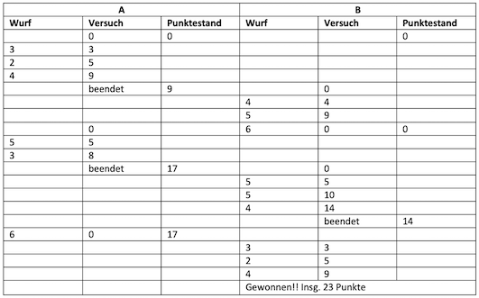

# Aufgaben

##### Aufgabe 1 (Würfelspiel)

??? "Aufgabe 1"

	Informieren Sie sich über die Scanner class in java.util (Beispiele finden sie hier: https://www.programiz.com/java-programming/scanner https://javabeginners.de/Ein-_und_Ausgabe/Scanner.php https://www.w3schools.com/java/java_user_input.asp ) 

	**Aufgabe**

	1. Implementieren Sie folgendes Würfelspiel:
		- An dem Spiel können beliebig viele Spieler teilnehmen.
		- Die Spieler sind nacheinander an der Reihe.
		- Wenn ein Spieler an der Reihe ist, dann befindet er sich in einem *Versuch*.
		- In einem *Versuch* kann der Spieler so lange würfeln, bis er entweder
			- eine 6 würfelt oder er
			- den Versuch freiwillig beendet.  
		- Hat der Spieler eine 6 gewürfelt, wird der gesamte *Versuch* mit `0` Punkten bewertet.
		- Hat der Spieler den Versuch freiwillig beendet, wird die in dem *Versuch* erzielte Summe aus sein Punktekonto addiert (gespeichert).
	2. Der Spieler, der zuerst eine bestimmte Punktzahl (z.B. `20`) erreicht hat, hat gewonnen.  
		Beispiel mit zwei Spielern `A` und `B` bis Gesamtpunktzahl `20`:
		
	3. Laden Sie Ihr Lösung in Moodle hoch! Viel Spaß und viel Erfolg!
