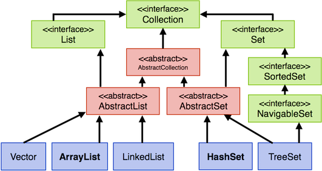
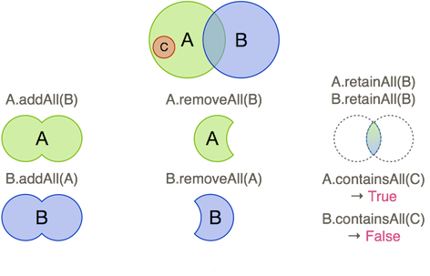

# Collections

Um mehrere Werte oder Referenzen gleichen Typs zu speichern, haben wir bisher Arrays verwendet. Die Länge von Arrays wird bei der Initialisierung festgelegt und lässt sich dann nicht mehr verändern. Wenn ein weiteres Element einem vollen Array hinzugefügt werden soll, muss zunächst ein neues Array erstellt werden, das länger ist als das alte und dann müssen alle Elemente aus dem alten Array in das neue Array kopiert werden, ehe das neue Element hinzugefügt wird. Das ist recht aufwendig. Darüber hinaus ist es beispielsweise auch aufwendig, in Arrays Doppelungen zu vermeiden. Für ein Element, das in ein Array eingefügt werden soll, muss dafür zunächst geprüft werden, ob es nicht bereits im Array enthalten ist. Diese Nachteile führen dazu, dass wir uns nun mit Datenstrukturen beschäftigen, die ebenfalls mehrere Elemente speichern können, deren Verwaltung aber nicht so aufwendig ist, wie bei Arrays. Diese Datenstrukturen heißen *Collections*. 

*Collections* haben drei wesentliche Eigenschaften:

- Eine *Collection* hat **keine festgelegte Länge**, d.h. es sind beliebig viele Elemente in einer *Collection* speicherbar.
- In eine *Collection* können nur Elemente von **Referenztypen** gespeichert werden, d.h. **keine Wertetypen** (`int`, `double`, `boolean`, `char`, ...). Um auch solche "Werte" speichern zu können, werden wir *Wrapper*-Klassen kennenlernen. 
- Im Gegensatz zu Arrays können in einer Collection Elemente verschiedener Referenztypen gespeichert werden. Das ist aber eher ein Problem und kein Feature. Wir werden das vermeiden, da die Verwaltung von Elementen verschiedener Typen fehleranfällig ist. Wir werden Collections *typisieren*, damit sie nur Elemente eines Typs speichern kann.

## Arten von Collections

Es gibt unterschiedliche Arten von *Collections*, welche je nach Einsatzzweck verwendet werden:

<table>
	<thead>
		<tr>
			<th> Typ </th>
			<th> Struktur </th>
			<th> Zugriff </th>
			<th> Eigenschaften </th>
		</tr>
	</thead>
	<tbody>
		<tr>
			<td> <code>List</code> </td>
			<td> Menge </td>
			<td> wahlfrei (indexbasiert) <br> Iterator</td>
			<td> kann Elemente mehrfach enthalten </td>
		</tr>
		<tr>
			<td> <code>Set</code> </td>
			<td> Menge </td>
			<td> Iterator </td>
			<td> keine doppelten Elemente <br/> keine Ordnung der Elemente </td>
		</tr>
		<tr>
			<td> <code>Map</code>  </td>
			<td> Schlüssel-Werte-Paare </td>
			<td> schlüsselbasiert</td>
			<td> Schlüssel ist eindeutig <br> Werte können mehrfach sein </td>
		</tr>
		<tr>
			<td> <code>Stack</code>  </td>
			<td> Stapel/Stack </td>
			<td> oberstes Element</td>
			<td> last-in-first-out-Prinzip </td>
		</tr>
		<tr>
			<td> <code>Queue</code>  </td>
			<td> Warteschlange </td>
			<td> erstes und letztes Element </td>
			<td> first-in-first-out-Prinzip </td>
		</tr>
	</tbody>
</table>

Wir werden uns in diesem Semester aber nur mit den Collections `List`, `Set` und `Map` beschäftigen. Das Prinzip eines Stacks haben wir bereits kennengelernt, als wir uns über den [Methodenstack](https://freiheit.f4.htw-berlin.de/prog1/methodenstack/#methodenstack) in Programmierung 1 unterhalten hatten. Ein Stack ist ein Stapel, auf den man ein Element legen kann (`pop`) und von dem man das oberste Element entfernen kann (`pop`). Mithilfe von `top` erhält man lesenden Zugriff auf das oberste Element. Auf alle anderen Elemente hat man im Stack keinen Zugriff. 

Eine Queue implementiert das Prinzip einer Warteschlange. Ein Element kann an das Ende einer Warteschlange angehängt werden. Herausgenommen werden kann aber immer nur das Element am Anfang (dem *head*) der Warteschlange. 

Eine Liste (`List`) ist noch am ehesten vergleichbar mit einem Array, außer dass es keine Größenbeschränkung gibt und dass nur Referenztypen in eine Liste gespeichert werden. In Listen werden ebenfalls Indizes verwaltet, so dass man auf die Elemente Zugriff wie in einem Array hat. Es gibt Listen, die automatisch sortiert werden. In Listen können Elemente doppelt vorkommen. Von Doppelungen in Collections wird gesprochen, wenn für zwei Elemente `e1` und `e2` gilt `e1.equals(e2) == true` (oder `e1.hashCode() == e2.hashCode()`). 

Eine Menge (`Set`) hat die besondere Eigenschaft, dass sie keine Doppelungen enthält. Wird versucht, ein Element einer Menge hinzuzufügen, welches bereits in der Menge enthalten ist, dann wird das Element **nicht** hinzugefügt. Deshalb gibt die `add(element)`-Methode für eine Menge ein `boolean` zurück, damit erkannt werden kann, ob das Element hinzugefügt wurde (`true`) oder nicht (`false`). 

Eine `Map` kann man sich wie eine Tablle aus zwei Spalten vorstellen. In der linken Spalte stehen Schlüssel `key` und in der rechten die Werte `value`. Jedem Schlüssel ist genau ein Wert zugeordnet. Jeder Schlüssel ist eindeutig, d.h. es gibt keine Doppelungen unter den Schlüsseln (die Schlüssel in einer `Map` sind eine `Set`). Werte können allerdings doppelt vorkommen (haben aber jeweils einen eigenen Schlüssel). 

Eine kurze Entscheidungshilfe, welche Collection verwendet wird, zeigt die folgende Abbildung:


## Der Collection-Klassenbaum

Leider ist die Verwaltung von Collections in Java nicht einheitlich. Das liegt daran, dass (unverständlicherweise) Listen und Mengen in einer anderen Vererbungshierarchie verwaltet werden, als Maps. Wir schauen uns die Vererbungshierarchie von `Collection` einaml an. Darin kommen die Listen und Mengen vor, aber nicht Maps.



Die "Mutter-Klasse" der Collections `List` und `Set` ist `Collection`. In der Abbildung fallen unterschiedliche Farben auf. Die grüngefärbten Klassen sind sogenannte *Interfaces*. Interfaces lernen wir später noch kennen. Ebenso wie die rotgefärbten Klassen, bei denen es sich um *abstrakte* Klassen handelt. Das soll uns zunächst nicht besonders interessieren, aber wir können uns merken, dass wir die grüngefärbten Klassen als Typen verwenden (insb. den Typ `List` für die Listen und den Typ `Set` für die Mengen). Wir können aber keine konkreten `List`-Objekte bzw. keine konkreten `Set`-Objekte erzeugen. Das geht nur mit dem blaugefärbten Klassen. Das bedeutet, dass wir z.B. ein konkretes `ArrayList`-Objekt erzeugen werden oder ein konkretes `HashSet`-Objekt. Hier einige Beispiele:

```java
import java.util.ArrayList;
import java.util.HashSet;
import java.util.LinkedList;
import java.util.List;
import java.util.Set;
import java.util.TreeSet;

public class Collections {

	public static void main(String[] args) {
		List l1 = new ArrayList();
		List l2 = new LinkedList();
		
		Set s1 = new HashSet();
		Set s2 = new TreeSet();
	}
}
```

Beachten Sie, alle Klassen aus dem `java.util`-Paket zu importieren! Eine Klasse `List` gibt es z.B. auch im `java.awt`-Paket! Statt alle Klassen einzeln zu importieren können Sie auch schreiben:

```java
import java.util.*;
```

Der `*` ist eine *Wildcard* und importiert alle Klassen aus `java.util`. 

Zur Diskussion, wann `ArrayList` besser ist und wann `LinkedList`, siehe [hier](https://stackoverflow.com/questions/322715/when-to-use-linkedlist-over-arraylist-in-java). Eine Diskussion über die Unterschiede zwischen `HashSet` und `TreeSet` finden Sie z.B. [hier](https://stackoverflow.com/questions/1463284/hashset-vs-treeset). Wir werden für Listen hauptsächlich Objekte von `ArrayList` erstellen und für Mengen hauptsächlich Objekte von `HashSet`.

## Mengen - Sets

Wir betrachten zunächst Mengen genauer und beginnen mit einem Beispiel:

```java linenums="1"
import java.util.*;

public class Collections {

	public static void main(String[] args) {
		
		Set menge = new HashSet();

		String s1 = "erster";
		String s2 = "zweiter";
		String s3 = "dritter";
		String s4 = "zweiter";

		System.out.println(menge.add(s1)); // true
		System.out.println(menge.add(s2)); // true
		System.out.println(menge.add(s3)); // true
		System.out.println(menge.add(s4)); // false

		System.out.println(menge.size()); // 3

		Iterator it = menge.iterator();
		while(it.hasNext())
		{
			System.out.println(it.next());
		} 

	}
}
```

In Zeile `1` werden zunächst alle verwendeten Klassen aus dem `java.util`-Paket geladen. Das sind für unser Beispiel `Set`, `HashSet` und `Iterator`. Die `Iterator`-Klasse wird verwendet, um durch unsere Menge `menge` zu laufen. Wir werden auf den `Iterator` gleich genauer eingehen, lernen aber bald eine einfachere Lösung kennen, um durch unsere Menge zu iterieren. 

In Zeile `7` wird die Menge `menge` erzeugt. Wir deklarieren dafür den Typ `Set` und erzeugen unter Verwendung des parameterlosen Konstruktors von `HashSet` ein `HashSet`-Objekt. Die `menge` hat also den Compilertyp `Set` und mindestens den Laufzeittyp `HashSet` (natürlich noch weitere Laufzeittypen, z.B. `Object`). 

In den Zeilen `14-17` werden der `menge` Elemente hinzugefügt. Diese Elemente sind hier vom Typ `String`. Das Hinzufügen von Elementen zu einer Menge erfolgt mit der Methode `add(element)`. Diese Methode gibt ein `boolean` zurück. Wir lassen in den Zeilen `14-17` diese Rückgabe auf die Konsole ausgeben und stellen fest, dass wir folgende Ausgaben erhalten: 

```bash
true
true
true
false
```

Die `add()`-Methode gibt also 3x ein `true` zurück und beim vierten Aufruf ein `false`. Das liegt daran, dass beim vierten Aufruf von `add()` (Zeile `17`) das übergebene Element `s4` **nicht** in die Menge `menge` eingefügt wird, da sich in dieser Menge bereits ein `String` mit dem Wert `"zweiter"` befindet und eine Menge **keine Doppelungen** enthalten darf. Da `s2.equals(s4)` den Wert `true` zurückgibt, erkennt die `add()`-Methode, dass bereits ein gleiches Objekt in der Menge enthalten ist und `s4` wird deshalb nicht eingefügt. 

In Zeile `19` lassen wir uns die Anzahl der Elemente in der Menge `menge` ausgeben. Dies erfolgt mithilfe der `size()`-Methode (in Collections ist es also nicht `length()`, auch nicht `length` und auch nicht `getLength()` oder `getSize()`, sondern `size()`). Der Wert von `size()` in unserem Beispiel ist `3`. 

### Der Iterator

Mithilfe der Klasse [Iterator](https://docs.oracle.com/en/java/javase/11/docs/api/java.base/java/util/Iterator.html) *iterieren* wir durch eine Collection, d.h. wir *laufen* durch unsere Collection und betrachten alle Elemente aus der Collection. 

Die Klasse `Iterator` besitzt drei Objektmethoden (eigentlich vier, aber die vierte Methode soll uns zunächst nicht interessieren):

- `hasNext()`: liefert ein `true` zurück, wenn sich mindestens ein weiteres Element in der Collection befindet; wenn nicht, dann `false`,
- `next()`: liefert das nächste Element aus der Iteration zurück (und entfernt es daraus), 
- `remove()`: löscht das mit `next()`zurückgegebene Element.

In Zeile `21` erzeugen wir zunächst mit der `iterator()`-Methode aus `Set` ein Objekt von `Iterator`. Die Referenz auf dieses Objekt nennen wir hier `it`. 

Die `while()`-Schleife in den Zeilen `22-25` durchläuft nun diese Iteration, indem sie mithilfe von `hasNext()` prüft, ob sich noch ein weiteres Element in der Iteration befindet und wenn ja, dann wird es mithilfe von `next()` aus der Iteration entnommen und in Zeile `24` auf die Konsole ausgegeben. 

Wir erhalten für unser Beispiel folgende Ausgaben:

```bash
zweiter
dritter
erster
```

Darin sehen wir auch, dass die Reihenfolge des Einfügens in eine Menge nicht gewahrt wird. Wir haben die Elemente in der Reihenfolge `"erster"`, `"zweiter"`, `"dritter"` in die Menge eingefügt, aber die Ausgabe erfolgt in der Reihenfolge `"zweiter"`, `"dritter"`, `"erster"`. Auf die Reihenfolge haben wir in Mengen keinen Einfluss!

### Methoden für Mengen

Wir haben bereits drei Methoden für Mengen kennengelernt: `add()`, `size()` und `iterator()`. Tatsächlich sind das Methoden, die in allen Klassen zur Verfügung stehen, die von `java.util.Collection` erben (*erben* ist hier eigentlich nicht ganz richtig, da es sich bei `java.util.Collection` um ein Interface handelt, aber das soll uns hier zunächst egal sein). Wir betrachten nun alle wesentlichen Methoden, die wir für Mengen und Listen zur Verfügung haben (siehe dazu auch die Java-Dokumentation von [Collection](https://docs.oracle.com/en/java/javase/11/docs/api/java.base/java/util/Collection.html)):

<table>
	<thead>
		<tr>
			<th> Methode </th>
			<th> Beschreibung </th>
		</tr>
	</thead>
	<tbody>
		<tr>
			<td> <code>boolean add(E element)</code> </td>
			<td> Fügt Element <code>element</code> in die Collection ein. Gibt <code>true</code> zurück, wenn Element hinzugefügt wurde sonst <code>false</code>. </td>
		</tr>
		<tr>
			<td> <code>boolean addAll(Collection c)</code> </td>
			<td> Fügt <strong>alle</strong> Elemente der Collection <code>c</code> in die Collection ein. Gibt <code>true</code> zurück, wenn mindestens ein Element hinzugefügt wurde sonst <code>false</code>. </td>
		</tr>
		<tr>
			<td> <code>void clear()</code>  </td>
			<td> Entfernt alle Elemente aus der Collection.</td>
		</tr>
		<tr>
			<td> <code>boolean contains(E element)</code>  </td>
			<td> Gibt <code>true</code> zurück, wenn sich <code>element</code> in der Collection befindet, sonst <code>false</code>.</td>
		</tr>
		<tr>
			<td> <code>boolean containsAll(Collection c)</code>  </td>
			<td> Gibt <code>true</code> zurück, wenn sich <strong>alle</strong> Elemente der Collection <code>c</code> in der Collection befinden, sonst <code>false</code>.</td>
		</tr>
		<tr>
			<td> <code>boolean isEmpty()</code>  </td>
			<td> Gibt <code>true</code> zurück, wenn sich keine Elemente in der Collection befinden, sonst <code>false</code>.</td>
		</tr>
		<tr>
			<td> <code>Iterator<E> iterator()</code>  </td>
			<td> Erzeugt einen Iterator, welcher auf das erste Element der Collection zeigt.</td>
		</tr>
		<tr>
			<td> <code>boolean remove(Object o)</code>  </td>
			<td> Entfernt <code>o</code> aus der Collection und gibt <code>true</code> zurück, wenn ein Element entfernt wurde, sonst <code>false</code>.</td>
		</tr>
		<tr>
			<td> <code>boolean removeAll(Collection c)</code>  </td>
			<td> Entfernt <strong>alle</strong> Elemente aus <strong>c</strong> aus der Collection und gibt <code>true</code> zurück, wenn <strong>mindestens ein</strong> Element entfernt wurde, sonst <code>false</code>.</td>
		</tr>
		<tr>
			<td> <code>int size()</code>  </td>
			<td> Gibt die Anzahl der Elemente in der Collection zurück.</td>
		</tr>
		<tr>
			<td> <code>Object[] toArray()</code>  </td>
			<td> Gibt die Elemente in der Collection in einem Array-Datentyp zurück.</td>
		</tr>
	</tbody>
</table>

Der *TyP* `E` in der Tabelle ist ein Platzhalter für einen konkreten Typ. Bei dem `Iterator` sehen wir eine neue Syntax `<E>`. Diese lernen wir gleich kennen. `E` steht, wie gesagt, für einen beliebigen Typ. Die *Typisierung* wollen wir zunächst motivieren. 

### Typisieren

Generell können in Collections Objekte verschiedener Typen gespeichert werden. Es wäre also möglich, so etwas hier zu tun:

```java 
	Set menge = new HashSet();
	menge.add(new String("erster"));		// String einfügen
	menge.add(new Power(2,4));				// Power einfügen
	menge.add(new Point(2,3));				// Point einfügen
	menge.add(new Konto());					// Konto einfügen
``` 

Das Speichern von Objekten verschiedenen Typs ist jedoch sehr fehleranfällig und sollte unbedingt vermieden werden! Es gibt auch nicht wirklich sinnvollen Anwendungsbeispiele dafür. 

Stattdessen wollen wir angeben, welcher Typ die Objekte haben sollen, die in unserer Collection gespeichert werden können. Dazu **typisieren** wir die Collection. 

> Das *Typisieren* einer Collection erfolgt mithilfe der *Diamond*-Syntax: <br>
> 		`Collection<Typ> name = new KonkreteKlasse<>();`

Wir **typisieren** die Menge `menge` aus dem eben gezeigten Beispiel:

```java 
	Set<String> menge = new HashSet<>();	// mit String typisiert - menge nimmt nur Strings auf
	menge.add(new String("erster"));		// String einfügen
	menge.add(new Power(2,4));				// Fehler - kein String
	menge.add(new Point(2,3));				// Fehler - kein String
	menge.add(new Konto());					// Fehler - kein String
```

Wir haben `menge` **typisiert** und angegeben, dass `menge` nur Objekte vonm Typ `String` aufnehmen kann. Dazu geben wir bei der Typdeklaration `Set<String>` den Elemente-Typ in spitzen Klammern an. Diese spitzen Klammern werden auch in den Konstruktoraufruf eingefügt `new HashSet<>();`. Darin muss der Typ aber nicht wiederholt werden (der ist ja aus der Deklaration klar). 

Der Versuch, Objekte eines anderen Typs als `String` in die Collection einzufügen, scheitert bereits zur Compilezeit, d.h. das Programm lässt sich gar nicht übersetzen, wenn versucht wird, Objekte anderen Typs als der bei der Typisierung Angegebene einzufügen. 

Unser einführendes Beispiel von oben ist deshalb besser mit Typisierung: 


```java linenums="1"
import java.util.*;

public class Collections {

	public static void main(String[] args) {
		
		Set<String> menge = new HashSet<>();

		String s1 = "erster";
		String s2 = "zweiter";
		String s3 = "dritter";
		String s4 = "zweiter";

		System.out.println(menge.add(s1)); // true
		System.out.println(menge.add(s2)); // true
		System.out.println(menge.add(s3)); // true
		System.out.println(menge.add(s4)); // false

		System.out.println(menge.size()); // 3

		Iterator<String> it = menge.iterator();
		while(it.hasNext())
		{
			System.out.println(it.next());
		} 

	}
}
```

Beachten Sie, dass auch der Iterator (Zeile `21`) typisiert wird.

### Die for-each-Schleife

Wenn wir unsere Collection typisieren, haben wir auch eine einfachere Möglichkeit, durch diese zu laufen als die Verwednung des Iterators. Wir können stattdessen die *for-each*-Schleife verwenden. Die allgemeine Syntaxh einer solchen Schleife ist:

```java
for(TypElement element : collection)
{

}
```

Für unser Beispiel könnten wir den Iterator ersetzen durch diese Schleife:

```java linenums="1" hl_lines="21-24"
import java.util.*;

public class Collections {

	public static void main(String[] args) {
		
		Set<String> menge = new HashSet<>();

		String s1 = "erster";
		String s2 = "zweiter";
		String s3 = "dritter";
		String s4 = "zweiter";

		System.out.println(menge.add(s1)); // true
		System.out.println(menge.add(s2)); // true
		System.out.println(menge.add(s3)); // true
		System.out.println(menge.add(s4)); // false

		System.out.println(menge.size()); // 3

		for(String s : menge)
		{
			System.out.println(s);
		}

	}
}
```

Übrigens: anstelle der Collection (hier: `menge`) könnte auch ein Array stehen. Wenn Sie also vollständig durch Array laufen möchten, müssen Sie das nicht zwingend über alle Indizes machen, sondern können dafür auch diese *for-each*-Schleife verwenden. 

??? "Übung"
	Ersetzen Sie im oberen Beispiel `HashSet` durch `TreeSet`. Erkennen Sie einen Unterschied?

## Listen

Der Umgang mit Listen ist ähnlich dem Umgang mit Mengen, da beide von `java.util.Collection` abgeleitet sind. Deshalb stehen uns für Listen die gleichen Methoden zur Verfügung, wie für Mengen. Listen können wir uns eher wie Arrays vorstellen. In Listen gibt es, im Unterschied zu Mengen, index-basierte Zugriffe und auch Doppelungen. Wir betrachten ein Beispiel:

```java linenums="1"
import java.util.*;

public class Collections {

	static void fillList(List<String> list) 
	{
		for (int i = 0; i < 10; i++) 
		{ 
			list.add(String.valueOf(i)); 
		}
	}

	static void printList(List<String> list) 
	{
		Iterator<String> it = list.iterator();
		while(it.hasNext()) 
		{
			System.out.print(it.next() + " ");
		}
		System.out.println();
		System.out.println("End of list");
	}

	public static void main(String[] args)
	{
		List<String> list1 = new ArrayList<>();
		fillList(list1);
		printList(list1);

		List<String> list2 = new LinkedList<>();
		fillList(list2);
		list2.remove("3");		// Wert!
		list2.remove(6);		// Index!
		list1.removeAll(list2);
		printList(list2);		// 0 1 2 4 5 6 8 9
		printList(list1);		// 3 7
	}

}
```

Wir erstellen uns zwei Listen `list1` (Zeile `26`) und `list2` (Zeile `30`). Beide sind vom Compilertyp [List](https://docs.oracle.com/en/java/javase/11/docs/api/java.base/java/util/List.html) und beide sind *typisiert* mit `String`, d.h. sie können nur Strings aufnehmen. 

Die Methode `fillList()` (Zeilen `5-11`) befüllt die übergebene Liste mit den Ziffern `0...9`. Da die Liste Strings erwartet, werden die `int`-Ziffern mithilfe von `String.valueOf()` in einen `String` umgewandelt (Zeile `9`). Die `add()`-Methode fügt die Strings hinzu (Zeile `9`).  

Die Methode `printList()` (Zeilen `13-33`) gibt die Elemente der übergebenen Liste mithilfe des Iterators aus. Es wird jede Ziffer ausgegeben, gefolgt von einem Leerzeichen (Zeile `18`). 

Der Aufruf von `printList(list1);` in Zeile `28` führt zu folgender Ausgabe:

```bash
0 1 2 3 4 5 6 7 8 9 
End of list
```

Die Liste `list2` wird zunächst ebenfalls mit den Ziffern `0...9` (jeweils als `String`) befüllt. Die Anweisung `list2.remove("3");` in Zeile `32` bewirkt, dass der **Wert** `"3"` aus der Liste gelöscht wird. Nach diesem Löschen enthält die Liste `list2` noch folgende Werte:

```bash
"0" "1" "2" "4" "5" "6" "7" "8" "9" 
```

In Zeile `33` wird nun das Element aus der Liste gelöscht, das unter dem Index `6` gespeichert ist. Das ist das Element `"7"`. Nach dem Löschen des Elementes enthält die Liste `list2` noch folgende Werte:

```bash
"0" "1" "2" "4" "5" "6" "8" "9" 
```

Die Anweisung `list1.removeAll(list2);` in Zeile `34` bewirkt nun, dass aus `list1` alle Werte gelöscht werden, die (auch) in `list2` enthalten sind, also `"0" "1" "2" "4" "5" "6" "8" "9"`. Das bewirkt, dass in `list1` dann nur noch die Werte `"3" "7"` übrig bleiben. 

Die Anweisung `printList(list2);` in Zeile `35` bewirkt folgende Ausgabe: 

```bash
0 1 2 4 5 6 8 9 
End of list
```

Die Anweisung `printList(list1);` in Zeile `36` bewirkt folgende Ausgabe: 

```bash
3 7 
End of list
```

Die Methode `printList()` hätte anstelle den Iterator zu verwenden auch mit der *for-each*-Schleife implementiert werden können:

```java linenums="13"
	static void printList(List<String> list) 
	{
		for(String s : list)
		{
			System.out.print(s + " ");
		}
		System.out.println();
		System.out.println("End of list");
	}
```

??? "Übung"
	Gegeben ist folgender Code:
	```java
	  Set<Integer> s1 = new HashSet<>();
	  Set<Integer> s2 = new HashSet<>();

	  for (int i = 10; i >= 1; i--) { s1.add(i); }
	  for (int i = 9; i <= 12; i++) { s2.add(i); }
	  
	  s1.addAll(s2);   
	```

	1. Was ist der Rückgabewert von `s1.addAll(s2);` und warum?
	2. Implementieren Sie die Ausgabe aller Werte von `s1` und `s2`. 

## Mengenoperationen

Angenommen, wir haben drei Mengen `A`, `B` und `C`, wobei alle Elemente aus `C` auch Elemente in `A` sind. Mithilfe der Methoden `addAll()`, `removeAll()`, `retainAll()`  und `containsAll()` lassen sich [Operationen über Mengen](https://mathepedia.de/Mengenoperationen.html) beschreiben, wie die folgende Abbildung zeigt:



## Stack und Queue

Wir werden uns, wie bereits erwähnt, nicht ausfürhlich mit [Stack](https://docs.oracle.com/en/java/javase/11/docs/api/java.base/java/util/Stack.html) und [Queue](https://docs.oracle.com/en/java/javase/11/docs/api/java.base/java/util/Queue.html) beschäftigen, wollen aber hier der Vollständigkeit halber, die gesonderten Methoden angeben, die diese beiden Arten von Collections betreffen:

#### Stack

- Last-In-First-Out-Prinzip
- `push(E element)` zum Hinzufügen
- `pop()` entfernt oberstes Element und gibt es zurück
- `empty()` prüft, ob der Stack leer ist

#### Queue

- First-In-First-Out-Prinzip
- `add()/offer()` zum Hinzufügen
- `remove()/poll()` entfernt vorderstes Element und gibt es zurück
- `element()/peek()` prüft, ob die Warteschlange leer ist

## Wertetypen in Collections

Wertetypen können nicht als Typen der Elemente in Collections verwendet werden. Es sind nur Referenztypen in Collections erlaubt. Für alle Wertetypen stehen entsprechende *Wrapper*-Klassen zur Verfügung: `Integer`, `Double`, `Float`, `Short`, `Byte`, `Long`, `Character`, `Boolean`:

```java linenums="1"
// Wertetypen können nicht als konkrete 
// Typen in Collections verwendet werden
List<int> l = new ArrayList<>(); 	// Fehler !!

// Verwendung der Wrapper-Klassen + Auto-Boxing
List<Integer> l = new ArrayList<>();

l.add(100);        // sogenanntes Auto-Boxing
```

Das obere beispiel zeigt in Zeile `3`, wie es **nicht** geht. Die `List l` kann nicht mit `int` typisiert werden. Stattdessen muss die *Wrapper*-Klasse `Integer` verwendet werden. Wir betrachten *Wrapper*-Klassen im nächsten Abschnitt.
