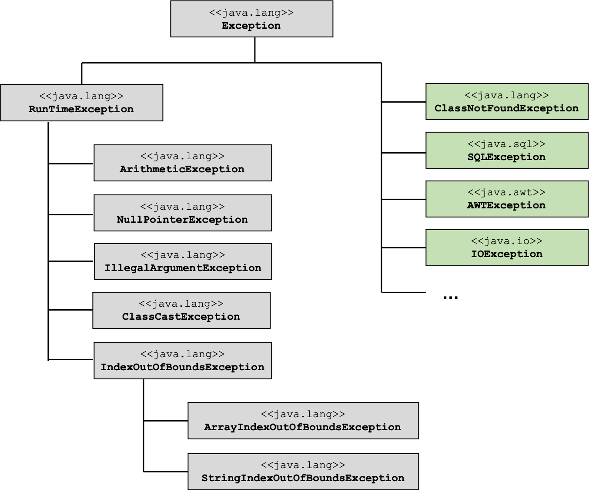

# Exceptions

!!! success "Motivation"
	Wir wissen nun, wie wir einen `String` in ein `int` umwandeln. Nämlich mithilfe der `parseInt(String)`-Methode der Klasse `Integer`. Was aber passiert, wenn der `String` gar keiner Zahl entspricht? Dann wird eine [Exception](exceptions.md#exceptions) geworfen und das Programm sofort beendet. Wir können aber gar nichts dafür, dass die Nutzerin keine Zahl eingegeben hat. Unser Programm ist eigentlich korrekt. Wie können wir den Programmabsturz verhindern? Wie können wir die Nutzerin solange bitten, eine Zahl einzugeben, bis sie wirklich eine Zahl eingibt?

*Exceptions* kennen wir schon, denn sie passieren uns häufiger. Wenn wir z.B. auf einen Index in einem Array zugreifen, dieser Index aber gar nicht existiert, wird eine `ArrayIndexOutOfBounds`-Exception geworfen. Wenn wir auf eine Objekteigenschaft zugreifen wollen, z.B. eine Objektmethode, die dafür verwendete Referenzvariable aber gar nicht auf ein Objekt zeigt, sondern auf `null`, erhalten wir eine `NullPointerException`. Wenn bei einer Nutzereingabe eine Zahl erwartet wird, um damit weiterrechnen zu können, die Nutzerin gibt aber etwas anderes als eine Zahl ein, dann wird ebenfalls eine Exception *geworfen*. 

Wir wollen aber gar nicht, dass das Programm in solchen Fällen abstürzt, sondern wir wollen diesen „Fehler“ erkennen und darauf reagieren. Grundsätzlich gibt es also zwei Arten von Fehlern:

- syntaktische Fehler --> können vom Compiler vor der Laufzeit erkannt werden; das Programm wird gar nicht erst vollständig compiliert und nicht ausgeführt und
- logische Fehler --> können erst zur Laufzeit erkannt werden. 

Im Falle der logischen Fehler, die erst zur Laufzeit auftreten, spricht man von *Laufzeitfehlern* (oder *Ausnahmen* oder *Exceptions*). Die Aufgabe beim Programmieren ist nun, zu identifizieren, *an welchen Stellen ein logischer Fehler auftreten könnte*, z.B. 

- fehlerhafte Benutzereingabe 
- Datenbank- oder Netzwerkverbindung nicht verfügbar 
- gesuchte Datei/Ordner nicht vorhanden usw. 

Die Stellen, an denen ein solcher logischer Fehler auftreten könnte, nennen wir im Folgenden *kritischer Abschnitt*. Wir müssen solche kritischen Abschnitte in unserem Quellcode identifizieren und haben dann die Möglichkeit, solche kritischen Abschnitte so zu implementieren, dass die Exception, die eventuell geworfen wird, *abgefangen* wird und das Programm dadurch nicht abstürzt. 

## try-catch

Die grundsätzliche Idee ist die, dass wir zunächst *versuchen* den kritischen Abschnitt einfach auszuführen. Wir *versuchen* z.B. einfach mit einem `index` auf das Array zuzugreifen, auch wenn wir gar nicht wissen, ob dies ein tatsächlicher `index` aus dem Array ist. Allerdings binden wir diesen *Versuch* in einen `try{}`-Block ein. 

Sollte in einem solchen `try{}`-Block nun eine Exception geworfen werden, dann *fangen* wir diese in einem `catch(){}`-Block auf und behandeln sie dort. Die allgemeine Syntax dafür sieht so aus:

=== "allgemeine Syntax try-catch"
	```java linenums="1"
	try	
	{
		// Anweisung(en), die evtl. Fehler verursachen (kritischer Abschnitt)
	}	
	catch(Exception e)	
	{
		// Behandlung der Exception	
	}
	```

Es passiert Folgendes: wir führen die Anweisung(en) in Zeile `3` aus. Wenn diese keine Exception wirft, also alles okay ist, dann machen wir einfach hinter dem `catch`-Block, also nach Zeile `8` weiter. Wenn aber die Anweisung(en) in Zeile `3` einen Laufzeitfehler verursachen, also eine Exception werfen, dann wird diese in Zeile `5` "aufgefangen" und in dem Anweisungsblock in den Zeilen `6-8` behandelt. Das Programm stürzt nun nicht mehr ab, sondern wir haben die Möglichkeit, auf die Exception zu reagieren. 

### Beispiel ohne try-catch

Wir verdeutlichen dieses Prinzip an einem ersten Beispiel:

=== "Beispiel zunächst ohne Behandlung der Exceptions"
	```java linenums="1"
	class Ausnahmen {

		static char charAt(String s, int index)
		{
			char c = s.charAt(index); 			// kritisch!
			return c;
		}
		static double divide(int divident, int divisor)
		{
			double result = divident/divisor; 	// kritisch!
			return result;
		}

		public static void main(String[] args) 
		{
			System.out.println(divide(5,0)); 			// ArithmeticException
			System.out.println(charAt("Hallo", 5)); 	// StringIndexOutOfBoundsException
		}
	}
	```

Das Beispiel enthält zwei Methoden `charAt()` und `divide`. Der `charAt`-Methode wird ein `String` übergeben und ein `index`. Die Methode gibt das Zeichen (`char`) zurück, dass im `String` unter dem `index` gespeichert ist (z.B. `charAt("Hallo", 1)` gibt das `'a'` zurück). Es wird jedoch gar nicht geprüft, ob `index` tatsächlich ein korrekter Index des Strings `s` ist, d.h. evtl. ist `index` kleiner als `0` oder größer als die Länge von `s` minus `1`. Die Anweisung  `s.charAt(index);` ist somit eine *kritische Anweisung*, denn sie kann (bei "falschem" `index`) eine `StringIndexOutOfBoundsException` werfen. 

Genau so ist die Anweisung `divident/divisor;` in der Methode `divide` eine *kritische Anweisung*, da es sein kann, dass der `divisior` gleich `0` ist. Bei der `int`-Division durch `0` wird eine `ArithmeticException` geworfen. 

Wenn die `main`-Methode nun wie angegeben ausgeführt wird, dann "stürzt" das Programm bereits bei Ausführung von Zeile `16` ab und Zeile `17` wird gar nicht mehr erreicht: 

```bash
Exception in thread "main" java.lang.ArithmeticException: / by zero
	at packageName.Ausnahmen.divide(Ausnahmen.java:10)
	at packageName.Ausnahmen.main(Ausnahmen.java:16)
```

Die Fehlermeldung gibt uns an, welche Zeile die Ausnahme geworfen hat, nämlich `Ausnahmen.java:10` und um welche Exception es sich handelt, nämlich `ArithmeticException: / by zero`.

Wenn wir in der `main`-Methode Zeile `16` auskommentieren, dann sehen wir, dass auch die Anweisung in Zeile `17` eine Exception wirft, nämlich: 

```bash
Exception in thread "main" java.lang.StringIndexOutOfBoundsException: String index out of range: 5
	at java.base/java.lang.StringLatin1.charAt(StringLatin1.java:47)
	at java.base/java.lang.String.charAt(String.java:702)
	at packageName.Ausnahmen.charAt(Ausnahmen.java:5)
	at packageName.Ausnahmen.main(Ausnahmen.java:17)
```

Die Fehlermeldung gibt uns an, welche Zeile unseres Programms die Ausnahme geworfen hat, nämlich `Ausnahmen.java:5` und um welche Exception es sich handelt, nämlich `StringIndexOutOfBoundsException: String index out of range: 5`. Sie sehen auch, dass eigentlich sogar die Anweisung in Zeile `47` in der Klasse `StringLatin1` in der dortigen Methode `charAt` die Exception geworfen hat. Wir werden dieses "Weiterreichen" von Exceptions gleich noch näher betrachten. 


### Beispiel mit try-catch

Zunächst "reparieren" wir unseren Code, indem wir `try-catch`-Blöcke um unsere kritischen Anweisungen hinzufügen:

=== "Beispiel mit Behandlung der Exceptions"
	```java linenums="1"
	class Ausnahmen {

		static char charAt(String s, int index)
		{
			char c = ' ';
			try
			{
				c = s.charAt(index); // kritisch!
			}
			catch(StringIndexOutOfBoundsException e)
			{
				System.err.println("Der Index war ausserhalb des Strings");
			}
			return c;
		}

		static double divide(int divident, int divisor)
		{
			double result = 0.0;
			try
			{
				result = divident/divisor; // kritisch!
			}
			catch(ArithmeticException ae)
			{
				System.err.println("Division durch 0 nicht definiert!");
			}
			return result;
		}

		public static void main(String[] args) 
		{
			System.out.println(divide(5,0)); 			// ArithmeticException
			System.out.println(charAt("Hallo", 5)); 	// StringIndexOutOfBoundsException
		}
	}
	```

Die kritischen Anweisungen wurden nun jeweils in einen `try`-Block integriert und die Behandlung der eventuell auftretenden Exceptions besteht nur aus einer jeweiligen Fehlerausgabe (ich habe hier dafür nicht das Standardausgabegerät `out` in den `println`-Anweisungen verwendet, sondern `err` - Zeilen `12` und `26`). 

Wenn wir das Programm nun ausführen (in `main` muss auch nichts mehr auskommentiert werden), dann erhalten wir die Ausgabe:

```bash
Division durch 0 nicht definiert!
0.0
Der Index war ausserhalb des Strings

```

Das Programm "stürzt" nun also nicht mehr ab, das ist schonmal ein Erfolg. So ganz optimal ist die Lösung allerdings noch nicht, da wir nun jeweils einen Nebeneffekt in unsere Methoden eingebaut haben. Angenommen, in der `divide`-Methode wird eine Exception geworfen, dann erfolgt durch Zeile `26` die Fehlerausgabe auf die Konsole. Danach wird in Zeile `28` aber `result` zurückgegeben (hat den Wert `0.0`, den wir bei der Initailisierung in Zeile `19` angegeben haben) und dieser Wert wird durch Zeile `33` auf die Konsole ausgegeben. Das gleiche gilt für die `charAt`-Methode. Auch da haben wir einen Nebeneffekt eingebaut und es wird durch Zeile `34` das Leerzeichen auf die Konsole ausgegeben. Nebeneffekte wollen wir aber unbedingt vermeiden und müssen unsere Implementierung deshalb noch ändern. 

Zunächst schauen wir uns aber den generellen Ablauf einer solchen Ausnahmesituation an:

### Ablauf einer Ausnahmesituation

Der generelle Ablauf beim "Werfen" eine Exception ist wie folgt:

1. Das Laufzeitsystem (JVM) erzeugt ein Ausnahme-Objekt (Objekt vom Elterntyp `Exception`), wenn eine Exception "geworfen" wird
2. Die Abarbeitung des Programmcodes wird **sofort** unterbrochen.
3. Das Laufzeitsystem sucht nach der nächsten `catch`-Klausel und führt diese aus.
4. Passt die gefundene `catch`-Klausel nicht zur Art der Ausnahme, wird die nächste `catch`-Klausel gesucht usw. 

Betrachten wir nochmal obigen Code, dann stellen wir fest, dass in der einen `catch`-Klausel (Zeile `10`) ein Objekt vom Typ `StringIndexOutOfBoundsException` erwartet wird. Wir werden gleich sehen, dass dies schon ein sehr spezieller Typ in der Vererbungshierarchie von `Exception` ist. Das Programm würde auch genau so funktionieren, wenn wir dort anstelle von `StringIndexOutOfBoundsException` allegmein eine `Exception` erwarten würden. Das gleiche gilt für die andere `catch`-Klausel (Zeile `24`), wo wir eine `ArithmeticException` erwarten. Wir schauen uns die Vererbungshierarchie der Exceptions gleich an. Generell gilt, dass man mehrere `catch`-Blöcke hintereinander setzen kann und der erste `catch`-Block, der dem erwarteten Parametertyp entspricht, wird ausgeführt. 

Wichtig ist, dass wir uns merken, dass durch eine Exception der Programmablauf **sofort** unterbrochen und zur nächsten "passenden" `catch`-Klausel gesprungen wird. 

### Ein weiteres Beispiel

Wir schauen uns dazu ein weiteres Beispiel an und ergänzen unsere Klasse `Ausnahmen` um eine weitere Methode `inputInt()`:

=== "eine weitere methode inputInt()"
	```java linenums="1" hl_lines="43-61"
	/*
	 * Sollten Sie mit dem Modul-System von Java arbeiten, d.h. sollten
	 * Sie eine Datei module-info.java in Ihrem Projekt-Ordner haben, 
	 * dann muessen Sie dort noch
	 * module ProjektName
	 * {
	 * 	requires java.desktop;
	 * }
	 * eintragen, damit Sie das Paket javax.swing importieren koennen. 
	 */
	import javax.swing.JOptionPane;

	public class Ausnahmen
	{
		static char charAt(String s, int index)
		{
			char c = ' ';
			try
			{
				c = s.charAt(index); // kritisch!
			}
			catch(StringIndexOutOfBoundsException e)
			{
				System.err.println("Der Index war ausserhalb des Strings");
			}
			return c;
		}

		static double divide(int divident, int divisor)
		{
			double result = 0.0;
			try
			{
				result = divident/divisor; // kritisch!
			}
			catch(ArithmeticException ae)
			{
				System.err.println("Division durch 0 nicht definiert!");
			}
			return result;
		}
		
		static int inputInt()
		{
			int inputInt = 0;
			boolean inputOk = false;
			String input ="";
			while(!inputOk)
			{
				input = JOptionPane.showInputDialog("Zahl :");
				inputOk = true;
				try {
					inputInt = Integer.parseInt(input);
				}
				catch(NumberFormatException e)
				{
					inputOk = false;
				}
			}
			return inputInt;
		}


		public static void main(String[] args) 
		{
			System.out.println(divide(5,0)); 			// ArithmeticException
			System.out.println(charAt("Hallo", 5)); 	// StringIndexOutOfBoundsException
			System.out.println("Zahl: " + inputInt());	// NumberFormatException
		}
	}
	```

Schauen wir uns die Implementierung von `inputInt()` genauer an: 

- in Zeile `50` wird ein kleines Eingabefenster erzeugt (`JOptionPane` ist eine Klasse aus dem `javax.swing`-Paket, welches wiederum im Modul `java.desktop` verfügbar ist). Die Eingabe in dieses Fenster wird als `String` zurückgegeben und in der Variablen `input` gespeichert. 
- in Zeile `53` wird versucht, den Eingabestring `input` in ein `int` umzuwandeln. Dazu wird die Methode `parseInt()` verwendet, die zur Klasse `Integer` gehört (`Integer` ist eine sogenannte *Wrapper-Klasse* - diese schauen wir uns nächste Woche an). 
- wenn `input` eine Zahl enthält, also z.B. so aussieht: `"1234"`, dann erzeugt `parseInt()` daraus die `int`-Zahl `1234` und alles ist ok. Wenn `input` jedoch keine Zahl enthält, also z.B. `"hallo"`, dann wirft `parseInt()` eine `NumberFormatException`, weil die Umwandlung des `String`s in ein `int` nicht möglich ist. 
- in Zeile `55` wird eine solche `NumberFormatException` aufgefangen. Die "Behandlung" dieser Excepion sieht so aus, dass der Schalter `inputOk` auf `false` gesetzt wird. 
- der gesamte Anweisungsblock *Fenster->Eingabe->try-catch* ist in eine Schleife eingebettet. Diese Schleife wird so lange ausgeführt, so lange der Wert von `inputOk` nicht `false` ist. Das bedeutet, wenn **keine** Zahl eingegeben wird, dann öffnet sich das Fenster erneut und es muss so lange eine Eingabe erfolgen, bis die Eingabe einer Zahl entspricht (und somit `parseInt()` keine Exception wirft)

Übrigens könnte die Anweisung `inputOk = true;` auch nach `parseInt()` in den `try`-Block geschrieben werden:

```java linenums="1" hl_lines="9 12"
static int inputInt()
{
	int inputInt = 0;
	boolean inputOk = false;
	String input ="";
	while(!inputOk)
	{
		input = JOptionPane.showInputDialog("Zahl :");
		
		try {
			inputInt = Integer.parseInt(input);
			inputOk = true;
		}
		catch(NumberFormatException e)
		{
			inputOk = false;
		}
	}
	return inputInt;
}
```

Zeile `12` wird nur genau dann erreicht, wenn `parseInt()` **keine** Exception wirft. Dann wird auch der `catch`-Block nicht betreten und die Schleife wird beendet. 

### Beispiel mit mehreren Exceptions

Wir betrachten jetzt einmal an einem Besipiel die bei [Ablauf einer Ausnahmesituation](#ablauf-einer-ausnahmesituation) unter Punkt 4 beschriebene Situation, dass die *nächstpassende* `catch`-Klausel gesucht wird. Wir erweitern dazu unsere Klasse `Ausnahmen` um eine weitere Methode `mehrereExceptions()`:

```java linenums="1"
public static void mehrereExceptions()
{
	String[] basen = {"2", "8", "10", "Hi"};
	int base = 0;
	double result= 0;
	boolean ok = true;
	
	for(int index = 0; index<=4; index++) 
	{
		try {
			base = Integer.parseInt(basen[index]);
			ok = true;
		}
		catch(NumberFormatException nfe) {
			System.out.println("Keine Zahl!");
			ok = false;
		}
		catch(IndexOutOfBoundsException ioobe) {
			System.out.println("Ausserhalb des Arrays");
			ok = false;
		}
		for(int exp = 0; exp<6 && ok; exp++) {
			result = Math.pow(base, exp);
			System.out.printf("%d ^ %d = %.0f %n", base, exp, result);
		}
	}
}
```

- In Zeile `3` definieren wir uns ein `String[]` mit 4 Einträgen. 
- Durch dieses `String[]` laufen wir mit einer `for`-Schleife (Zeile `8`) durch.
- In Zeile `11` wandeln wir jeden Eintrag aus dem `String[]` in eine `int`-Zahl um. 
- An zwei Stellen können Exceptions geworfen werden:
	- Bei dem Index-basierten Zugriff auf das Array `basen[index]` in Zeile `11` kann eine `ArrayIndexOutOfBounds`-Exception geworfen werden, falls `index` kein korrekter Index des `String[]` ist (gilt für `index==4`).
	- Bei der Umwandlung von `String` nach `int` durch `parseInt()` in Zeile `11` kann eine `NumberFormatException` geworfen werden, falls der entsprechende Eintrag im `String[]` keine Zahl ist (gilt für `basen[3]=='Hi'`).

Die Methode erzeugt die folgende Ausgabe:

```bash
2 ^ 0 = 1 
2 ^ 1 = 2 
2 ^ 2 = 4 
2 ^ 3 = 8 
2 ^ 4 = 16 
2 ^ 5 = 32 
8 ^ 0 = 1 
8 ^ 1 = 8 
8 ^ 2 = 64 
8 ^ 3 = 512 
8 ^ 4 = 4096 
8 ^ 5 = 32768 
10 ^ 0 = 1 
10 ^ 1 = 10 
10 ^ 2 = 100 
10 ^ 3 = 1000 
10 ^ 4 = 10000 
10 ^ 5 = 100000 
Keine Zahl!
Ausserhalb des Arrays
```

Das heißt, dass wenn für `parseInt("Hi")` eine `NumberFormatException` geworfen wird, dann wird der `catch`-Block ausgeführt, der eine `NumberFormatException` erwartet (Zeilen `14-17`). Der andere `catch`-Block wird nicht ausgeführt. 

Wenn für `basen[4]` eine `ArrayIndexOutOfBoundsException` geworfen wird, dann wird der  `catch`-Block ausgeführt, der eine `IndexOutOfBoundsException` erwartet (Zeilen `18-21`). Der andere `catch`-Block wird nicht ausgeführt.

Wir sehen, dass es offensichtlich auch eine `IndexOutOfBoundsException`-Klasse gibt. Das ist eine Elternklasse von `ArrayIndexOutOfBoundsException` und auch von `StringIndexOutOfBoundsException`. Wir schauen uns diese Vererbungshierarchie von `Exception` nun mal an:

### Die Vererbungshierarchie der Klasse Exception

Wenn Sie sich die Klasse `Exception` in der [Java-Dokumentation](https://docs.oracle.com/javase/8/docs/api/java/lang/Exception.html) einmal anschauen, dann sehen Sie, dass diese Klasse ein Unmenge von Kindklassen hat. Wir betrachten hier einmal die für uns wichtigsten Klassen:



Alle Exception-Klassen erben von der Klasse `Exception`, die im `java.lang`-Paket definiert ist. Grundsätzlich werden zwei Arten von Exceptions unterschieden:

- **checked** Exceptions: Checked Exceptions **müssen** geprüft werden, d.h. Methoden, die eine checked Exception werfen können, **müssen** in einen `try-catch`-Block integriert werden. Dies wird bereits zur Compilezeit geprüft, d.h. das Programm lässt sich gar nicht compilieren, wenn eine Methode, die eventuell eine checked Exception wirft, nicht in einem `try`-Block steht. In der Abbildung stehen checked Exceptions auf der rechten Seite (grün). 
- **unchecked** Exceptions: Unchecked Exceptions **können** geprüft werden, müssen aber nicht. Alle unchecked Exceptions leiten sich von der Klasse `RunTimeException` ab. Wir werden uns genau mit diesen uncheck Exceptions, also von `RunTimeException` abgeleiteten Klassen beschäftigen. 

Es gibt von `RunTimeException` noch viele weitere Kindklassen, wie man in der [Java-Dokumentation]() sehen kann, aber die in der Abbildung gezeigten sind die wichtigsten. Eine Kindklasse davon, die `IllegalArgumentException`-Klasse wird für uns noch eine weitere Rolle spielen, da wir von ihr erben werden, wenn wir uns eigene `Exception`-Klassen erstellen. 

### try-catch-finally

Prinzipiell besteht das Konstrukt `try` und `catch` nicht nur aus diesen beiden Blöcken, sondern auch noch aus dem `finally`-Block. Der `finally`-Block wird grundsätzlich **immer** ausgeführt, egal, ob eine Exception geworfen wird oder nicht. Die Syntax ist wie folgt:

```java 
	try	
	{
		// Anweisung(en), die evtl. Fehler verursachen (kritischer Abschnitt)
	}	
	catch(Exception e)	
	{
		// Behandlung der Exception	
	}
	finally
	{
	   	// Aufraeumen, z.B. Schliessen von Dateien, Beenden von 
		// Verbindungen zu Servern, Datenbanken etc.
	}
```

Typischerweise wird der `finally`-Block dazu verwendet, bestimmte Ressourcen wieder freizugeben, z.B. Dateien zu schließen, Verbindungen zu Servern, Datenbanken usw. zu beenden. Wir werden `finally` jedoch nicht sehr oft implementieren. 

### throws - eine Exception weiterreichen

Wir haben bis jetzt immer in den Methoden, in denen die kritische Anweisung ausgeführt wurde, diese direkt mit einem `try-catch`-Block "ummantelt". Das muss nicht unbedingt sein. Wir können eine in einer Methode geworfene Exception auch an die aufrufende Methode weiterreichen. Dann kann (und sollte) die Exception in der aufrufenden Methode abgefangen und behandelt werden. Um anzugeben, dass eine Methode evtl. eine Exception wirft, wird das Schlüsselwort `throws` verwendet. Wir erweiteren also die Deklaration einer Methode (also den Methodenkopf) um `throws` und danach kommt der entsprechende Typ der Exception, die in der Methode geworfen werden kann. Die allgemeine Syntax einer Methodendeklaration sieht somit so aus:

```java
[modifizierer] [rueckgabetyp] methodenname throws ExceptionType
{
	// Anweisungsblock
	// wirft (evtl.) Exception
}	
```

Wir betrachten auch dafür ein Beispiel und erweiteren unsere Klasse `Ausnahmen` um die Methode `getValueAtIndex`: 

```java linenums="1"
static int getValueAtIndex(int[] field, int index) throws ArrayIndexOutOfBoundsException
{
	return field[index];
}


public static void main(String[] args) 
{
	System.out.println(divide(5,0)); 			// ArithmeticException
	System.out.println(charAt("Hallo", 5)); 	// StringIndexOutOfBoundsException
	System.out.println("Zahl: " + inputInt());	// NumberFormatException
	mehrereExceptions();
	
	int value = 0;
	boolean ok = true;
	int[] field = {8, 3,-4, 2, -9};
	try
	{
		value = getValueAtIndex(field,-3);
	}
	catch(ArrayIndexOutOfBoundsException e)
	{
		System.out.println("Index ausserhalb des Arrays!");
		ok = false;
	}
	if(ok) 
	{
		System.out.println("value : " + value);
	}
}
```

Obwohl die Methode eine kritische Anweisung enthält (`field[index]`), ist diese Anweisung nicht in einen `try-catch`-Block eingebunden. Es kann nun also sein, dass bei Aufruf der Methode eine Exception (eine `ArrayIndexOutOfBoundsException`) geworfen wird. Wir geben das im Methodenkopf mithilfe von `throws ArrayIndexOutOfBoundsException` bekannt. Die aufrufende Methode (`main`) kann nun selbst den Aufruf der Methode `getValueAtIndex()` in einen `try-catch`-Block ummanteln und somit die Exception selbst abfangen und behandeln. Nur wenn keine Exception geworfen wird, wird der von der Methode `getValueAtIndex()` zurückgegebene Wert ausgegeben. 

Wenn wir an unsere [einleitenden Beispiele](#beispiel-mit-try-catch) denken (Methoden `charAt()` und `divide()`), dann erinnern wir uns, dass wir dort festegestellt haben, dss die Implementierung so nicht günstig war, da sie Nebeneffekte erzeugt hat, sobald eine Exception geworfen wurde. Diese Nebeneffekte werden bei der Implementierung von `getValueAtIndex()` vermieden, obwohl die grundsätzliche Idee die gleiche ist, wie bei `charAt()`. Der Nachteil ist, dass man die aufrufende Methode "zwingt", die Exception selbst zu behandeln. 

### Schöner Code

Der letzte Satz aus dem vorherigen Abschnitt ist insofern nicht ganz richtig, dass mit *unchecked* Exceptions ja genau nicht erzwungen wird, eventuelle Exceptions abzufangen. Es gibt gute Gründe dafür, alle eigenen Exceptions eher als *checked* Exceptions zu definieren, als als *unchecked* Exceptions. Aber zu eigenen Exceptions kommen wir gleich. 

Trotzdem können wir uns schon zum jetzigen Zeitpunkt einige Gedanken, über *schönen Code* in Bezug auf Exceptions machen: 

1. eine Methode sollte immer nur eine Sache erledigen (single responsibility principle - SRP)
2. --> die Methode kann nicht auch noch für das Abfangen des Fehlers zuständig sein (try-catch-Blöcke sind eh „hässlich“ und unleserlich)
3. --> lassen Sie Methode, die etwas erledigt, eine Exception werfen und leiten Sie diese weiter (`throws`) 
4. --> fangen Sie den Fehler in einer anderen Methode ab (`try`)
5. --> Sie können sogar die eigentliche Behandlung des Fehlers (`catch`) in eine dritte Methode auslagern (single responsibility)

Häufig sieht man, dass die Methode, die den Fehler abfängt (`try`) im `catch`-Block den Fehler protokolliert (in ein ErrorLog-File) und dann eine eigens erzeugte Exception an die Methode weiterleitet, die den Fehler behandelt. Wie man eine Exception erzeugt, schauen wir uns jetzt an. 

### throw - eigene Exceptions erzeugen

Zunächst kommt ein neues Schlüsselwort hinzu, nämlich `throw`. Unglücklicherweise ist dies dem Schlüsselwort `throws` sehr ähnlich. Mit `throw` erzeugen (werfen) wir eine eigene Exception, mit `throws` wird im Methodenkopf angegeben, dass die Methode (eventuell) eine Exception wirft und diese an die aufrufende Methode weitergibt. 

Angenommen, für einen Konstruktor der Klasse Dreieck werden Seitenlängen übergeben, die entweder kleiner als 0 oder die Summe von 2 Seitenlängen ist kleiner als die dritte Seite ist. Wir hatten uns bei der Bearbeitung der Aufgabe `Triangle`im ersten Semester bereits überlegt, dass dadurch kein "richtiges" Dreieck erzeugt wird, aber wir konnten das noch nicht verhindern. Das machen wir jetzt. Wie können wir also verhindern, dass ein solches Objekt erzeugt wird?

Die Lösung besteht darin, eine eigene Exception zu definieren und diese im Fehlerfall zu werfen. Mithilfe des Schlüsselwortes `throw` wird also eine eigene Exception geworfen. Bis jetzt *wurden* unsere Exceptions ja ("automatisch" durch die Laufzeitumgebung) geworfen. 

Für eine *eigene* Exception haben wir zwei Möglichkeiten:

- entweder erstellen wir uns eine eigene Exception-Klasse und leiten diese von der Klasse `Exception` oder von der Klasse `RunTimeException` ab (`extends Exception` bzw. `extends RunTimeException`) oder
- wir verwenden eine bereits existierende Exception-Klasse (typischerweise `IllegalArgumentException`).

#### throw new IllegalArgumentException

Wir implementieren unsere Klasse `Triangle` so, dass wir im Konstruktor für den Fall, dass eine Seite kleiner gleich 0 ist, eine `IllegalArgumentException` werfen. Dieser Exception kann ein `String` als Parameter übergeben werden, der im `catch`-Block mittels `getMessage()` wieder ausgelesen werden kann. Das gleiche machen wir für den Fall, dass die Summe von zwei Seiten kleiner der dritten Seite ist.

=== "Triangle mit eigenen IllegalArgumentExceptions"
	```java linenums="1"
	public class Triangle
	{
		private int a,b,c;
		
		public Triangle(int a, int b, int c) throws IllegalArgumentException
		{
			if(a<=0 || b<=0 || c<=0) 
			{
				throw new IllegalArgumentException("Seiten muessen groesser als 0 sein!");
			}
			else if(a>=(b+c) || b>=(a+c) || c>=(a+b)) 
			{
				throw new IllegalArgumentException("Kein Dreieck!");
			}
			else 
			{
				this.a = a;
				this.b = b;
				this.c = c;
			}
		}
		public static void main(String[] args) 
		{
			Triangle d;
			
			try {
				d = new Triangle(3,4,5);		//(3,4,0) und (3,4,8) probieren
			}
			catch(IllegalArgumentException e) 
			{
				System.out.println(e.getMessage());
			}
		}
	}
	```

Der Konstruktor fängt die Exception nicht selbst auf und behandelt sie auch nicht selbst, sondern leitet sie an die aufrufende Methode weiter (Zeile `5` - `throws IllegalArgumentException`). Im Konstruktor werden die Parameterwerte geprüft und

- entweder eine `IllegalArgumentException` geworfen, falls eine Seite kleiner gleich 0 ist (Zeile `9` - `throw new`) 
- oder eine `IllegalArgumentException` geworfen, falls die Summe von zwei Seiten kleiner als die dritte Seite ist (Zeile `13` - `throw new`) 
- oder die Objektvariablen die Werte der Parameter bekommen (wenn alles ok ist - Zeilen `17-19`).

Die Erzeugung eines `Triangle`-Objektes (also der Aufruf des Konstruktors) ist nun in einen `try-catch`-Block eingebettet (Zeilen `26-32`). Beachten Sie, dass es sein kann, dass `d` nach Aufruf des Konstruktors immernoch `null` ist (nämlich dann, wenn eine Exception geworfen wird). Wir haben hier gleich die `main`-Methode mit in die Klasse genommen, das sollte man natürlich nicht machen.

#### Eigene Exception-Klasse definieren

Wir erstellen uns eigene Exception-Klassen für die oben beschriebenen "Fehler" im Konstruktor von `Triangle`. Diese eigenen Exception-Klassen erben von der Klasse `Exception`. Damit sind die eigenen Exceptions **checked** Exceptions, d.h. sie **müssen** in einem `try-catch`-Block abgefangen und behandelt werden. 

=== "Eigene Klasse IllegalTriangleException" 
	```java linenums="1"
	public class IllegalTriangleException extends Exception
	{
		public IllegalTriangleException(String s) {
			super(s);
		}

		public IllegalTriangleException() {
			super("Each side has to be smaller than the sum of the other sides!");
		}
	}
	```

Die Klasse `IllegalTriangleException` verwenden wir für den Fall, dass die Summe zweier Seiten kleiner als die dritte Seite ist. 

=== "Eigene Klasse IllegalSideLengthException" 
	```java linenums="1"
	public class IllegalSideLengthException extends Exception
	{

		public IllegalSideLengthException(String s) {
			super(s);
		}

		public IllegalSideLengthException() {
			super("Sides must be greater than zero!");
		}
	}
	```

Die Klasse `IllegalSideLengthException` verwenden wir für den Fall, dass eine Seite kleiner gleich 0 ist. Für beide Klassen haben wir jeweils einen parameterlosen Konstruktor definiert, der ein Objekt von `Exception` erzeugt und dem eine Fehlermeldung als `String` im Parameter übergeben wird. Außerdem haben wir in beiden Klassen noch einen parametrisierten Konstruktor, dem eine Fehlermeldung als `String` übergeben werden kann. Wir haben nun die Wahl, ob wir den paarmeterlosen oder den parametrisierten Konstruktor verwenden. 

Die Anwendung dieser beiden Exception-Klassen in der Klasse `Triangle` könnte nun so aussehen (wir haben hier auch gleich die `main`-Methode mit in die Klasse genommen, das sollte man natürlich nicht machen):

=== "Triangle mit den selbst definierten Exception-Klassen"
	```java linenums="1" hl_lines="9 13 30"
	public class Triangle
	{
		private int a,b,c;
			
		public Triangle(int a, int b, int c) throws Exception
		{
			if(a<=0 || b<=0 || c<=0) 
			{
				throw new IllegalTriangleException();
			}
			else if(a>=(b+c) || b>=(a+c) || c>=(a+b)) 
			{
				throw new IllegalSideLengthException();
			}
			else 
			{
				this.a = a;
				this.b = b;
				this.c = c;
			}
		}

		public static void main(String[] args) 
		{
			Triangle d;
			
			try {
				d = new Triangle(3,4,5);		//(3,4,0) und (3,4,8) probieren
			}
			catch(Exception e) 
			{
				System.out.println(e.getMessage());
			}

		}
	}
	```

Beide eigenen Klassen sind ja auch vom Laufzeittyp `Exception`, da sie von dieser Klasse geerbt haben. Insofern ist der Parametertyp in der `catch`-Klausel mit `Exception` (Zeile `30`) passend. Wenn Sie anstelle der Zeilen `27-33` nur `d = new Triangle(3,4,5);` schreiben, stellen Sie fest, dass sich das Programm nicht übersetzen lässt, da es sich um **checked** Exceptions handelt, die in einem `try-catch`-Block abgefangen werden müssen. Eclipse bietet Ihnen dann aber einen QuickFix an `Surround with try/catch`. Das sollten Sie einmal ausprobieren. 

Wenn Sie anstelle von `Exception` von der Klasse `RunTimeException` erben, dann handelt es sich bei Ihren Exceptions um **unchecked** Exceptions. Es ist aber besseres Programmieren, wenn man **checked** Exceptions erstellt, denn dazu sind die Exceptions ja da, dass sie abgefangen und behandelt werden.

!!! success
	Wir haben Exceptions kennengelernt. Solche Laufzeitfehler können an verschiedenen Stellen passieren und haben unterschiedliche Typen (siehe Kindklassen von `Exception`, insb. von `RunTimeException`). Mithilfe von `try-catch-[finally]` können wir solche Exceptions abfangen und behandeln. Damit stürzt unser Programm nicht mehr ab. Mithilfe von `throws` zeigt eine Methode an, dass sie eine Exception erzeugen kann. Das Schlüsselwort `throw` weist die Laufzeitumgebung an, das angegebene Laufzeitobjekt (eine Exception) zu erzeugen und zu werfen. Checked Exceptions **müssen** behandelt werden (Aufruf der Exception-werfenden Methode in einem `try-catch`-Block). Unchecked Exceptions **können** behandelt werden, müssen aber nicht, sollten aber. Können wir ja jetzt schließlich...


