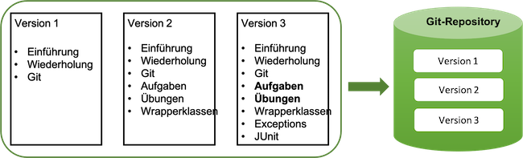
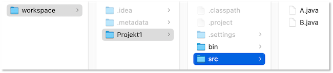
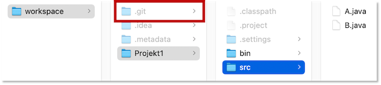
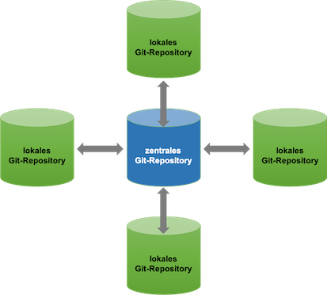
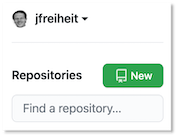
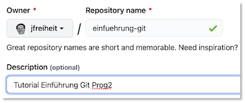
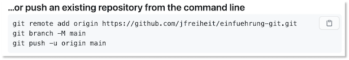

# Git

[Git](https://git-scm.com/) ist ein Versionierungswerkzeug für die Softwareentwicklung. Mit Git können Sie

- Ihre Software versionieren, d.h. Versionen Ihrer Software erstellen und zwischen diesen Versionen hin- und herwecheseln sowie
- im Team gemeinsam an einem Softwareprojekt arbeiten und die einzelnen Entwicklungen aller Teammitglieder geeignet zusammenführen. 

Git ist [Open Source](https://git-scm.com/about/free-and-open-source) und [frei verfügbar](https://git-scm.com/downloads). Entstanden ist Git im Rahmen der Entwicklung von [Linux](https://linuxfoundation.org/), initiiert durch [Linus Torvalds](https://github.com/torvalds), dem Initiator von Linux.

## Installation von Git

Um Git verwenden zu können, müssen Sie es zunächst installieren. Laden Sie sich Git für Ihr Betriebssystem von der [Download-Seite](https://git-scm.com/downloads) herunter bzw. gehen Sie so vor, wie für Ihr Betriebssystenm beschrieben. Installationshilfen erhalten Sie z.B. auch im frei verfügbaren [Git-Buch](https://git-scm.com/book/de/v2) unter [Git installieren](https://git-scm.com/book/de/v2/Erste-Schritte-Git-installieren) oder auch im [Video](https://git-scm.com/video/get-going) über die ersten Schritte mit Git. 

Wenn Sie unter Windows arbeiten, dann erhalten Sie mit Git eine `GitBash`. Wenn wir von nun an vom `Terminal` (oder `Shell` oder `Bash`) sprechen, dann verwenden Sie bitte immer diese `GitBash`. 

Nach erfolgreicher Installation können Sie im Terminal den Befehl

```bash
git --version
```

eingeben und es sollte eine Ausgabe, wie

```bash
git version 2.30.1
```

oder eine aktuellere Versionsnummer erfolgen.

Wir können Git nun verwenden und betrachten zunächst, wie [Git als Versionierungswerkzeug](https://git-scm.com/video/what-is-version-control) verwendet werden kann und schauen uns danach an, wie es als Kollaborationswerkzeug verwendet wird. 

## Git als Versionierungswerkzeug

Die grundsätzliche Idee von Git ist, Änderungen an Dateien und Ordnern so zu speichern, dass alle diese Änderungen nachverfolgbar sind. Git erzeugt sogenannte *Snapshots* aller Dateien und Ordner und speichert diese *Snapshots* nacheinander **lokal** ab. D.h. alles passiert bei Ihnen lokal auf dem Rechner, Sie benötigen keine Verbindung zu einem Server. Wenn Sie später im Team zu Mehreren an einem Projekt arbeiten, dann gleichen Sie immer nur die Historien Ihrer Snapshots ab. Git fügt immer nur hinzu und das ist auch korrekt so. Selbst, wenn in späteren Versionen Ihres eine Datei nicht mehr existiert, die in früheren Versionen des Projektes noch existierte, soll diese Datei gar nicht gelöscht werden, denn es könnte ja sein, dass Sie irgendwann nochmal die frühere Version anschauen wollen, die die Datei enthielt. 

Dieses Skript hier z.B. verwalte ich mit Git. Das bedeutet, dass alle Dateien eines Ordners (und Unterordnern) in einem sogenannten *Git-Repository* (oder nur *Repository*) verwaltet werden. Für dieses Skript hier könnte das z.B. so aussehen:



Das heißt, ich erstelle zunächst 3 Dateien: `Einführung`, `Wiederholung` und `Git` und "sage" Git, dass dies `Version1` sein soll. Danach füge ich 3 weitere Dateien hinzu `Aufgaben`, `Übungen` und `Wrapperklassen` und zusammen mit den vorherigen 3 Dateien aus Version 1 ergibt das dann `Version 2`. Danach ändere ich (füge hinzu) die Dateien `Aufgaben` und `übungen` und füge außerdem neue Dateien für `Exceptions` und `JUnit` hinzu und "sage", dass das insgesamt `Version 3` ergibt usw. Git verwaltet nun diese Versionen und der Vorteil ist, dass ich jede dieser Versionen separat zur Verfügung stellen könnte und auch auf diesen Versionen weiterarbeiten. Wir werden in Zukunft in Bezug auf Git aber nicht mehr unbedingt von Versionen sprechen, sondern von *Snapshots*. Wir schauen uns das nun in einem Besipiel an. 

### git init - ein Repository erstellen

Angenommen, wir haben in unserem `workspace` folgende Ordner-Struktur:



In dem `workspace` gibt es ein Projekt `Projekt1` und darin einen `src`-Ordner mit unseren `*.java`-Dateien und einen `bin`-Ordner mit unseren `*.class`-Dateien. Wir lassen für dieses einführende Beispiel einmal Pakete weg. Diese würden ja als Ordner-Struktur sowohl innerhalb von `src` als auch von `bin` auftauchen. So sieht also ein typischer `workspace` aus. Es gibt darin noch weitere Ordner und Dateien, wie z.B. `.idea`, `.metadata`, `.classpath`, `.project`, `.settings`, die von unseren Entwicklungsumgebungen (Eclipse, IntelliJ, ...) angelegt wurden. 

Wir wollen nun unseren `workspace` von Git verwalten lassen. Dazu wechseln wir im Terminal in den `workspace`-Ordner und führen dort das Kommando

```bash
git init
```

aus. Dieses Kommando erstellt das *Git-Repository*. Es muss genau einmal, nämlich ganz am Anfang zur Erstellung des Repositorys ausgeführt werden. Im Terminal erscheint

```bash
Hinweis: Als Name für den initialen Branch wurde 'master' benutzt. Dieser
Hinweis: Standard-Branchname kann sich ändern. Um den Namen des initialen Branches
Hinweis: zu konfigurieren, der in allen neuen Repositories verwendet werden soll und
Hinweis: um diese Warnung zu unterdrücken, führen Sie aus:
Hinweis: 
Hinweis: 	git config --global init.defaultBranch <Name>
Hinweis: 
Hinweis: Häufig gewählte Namen statt 'master' sind 'main', 'trunk' und
Hinweis: 'development'. Der gerade erstellte Branch kann mit diesem Befehl
Hinweis: umbenannt werden:
Hinweis: 
Hinweis: 	git branch -m <Name>
Leeres Git-Repository in /...IhrPfadZumWorkspaceOrdner.../workspace/.git/ initialisiert
```

Somit wurde ein *Git-Repository* erstellt. Der `workspace`-Ordner wird nun von Git verwaltet. Dies erkennen Sie daran, dass in dem `workspace`-Ordner ein `.git`-Ordner angelegt wurde:



Klicken Sie ruhig mal in den Ordner, um zu sehen, was da alles drin ist.

### .gitignore - Dateien aus der Verwaltung ausschließen

Git würde nun den gesamten `workspace`-Ordner verwalten. Das wäre zunächst auch gar kein Problem. Aber wenn Sie im Team zu mehreren am selben Projekt (workspace) arbeiten, dann wollen Sie bestimmte Dateien gar nicht untereinander austauschen, z.B. alle Dateien, die von Ihrer IDE erstellt wurden (z.B. `.idea`, `.metadata`, `.classpath`, `.project`, `.settings`). Auch alle Dateien im `bin`-Ordner müssen nicht von Git verwaltet werden, weil Sie ja stets neu durch das Compilieren erzeugt werden. 

Noch bevor wir nun also unsere erste Version erzeugen wollen, schließen wir zunächst einige Ordner und Dateien aus der Verwaltung von Git aus. Dazu wird im `workspace`-Ordner eine Datei `.gitignore` erstellt, in die wir alle Dateien und Ordner eintragen, die wir aus der Git-Verwaltung ausschließen wollen. Bevor wir das machen, geben wir im Terminal in unserem `workspace`-Ordner einmal den Befehl 

```bash
git status
```

ein. Dies wird der am meisten verwendete Befehl für uns sein, der mit dem Befehl bekommen wir Auskunft über den aktuellen Status des Repositorys. Die Ausgabe derzeit ist

```bash
Auf Branch master

Noch keine Commits

Unversionierte Dateien:
  (benutzen Sie "git add <Datei>...", um die Änderungen zum Commit vorzumerken)
	.DS_Store
	.idea/
	.metadata/
	Projekt1/

nichts zum Commit vorgemerkt, aber es gibt unversionierte Dateien
(benutzen Sie "git add" zum Versionieren)
```

Das müssen wir zum jetzigen Zeitpunkt noch nicht alles verstehen, aber wir sehen, dass Git derzeit die Datei `.DS_Store` und die Ordner `.idea/`, `.metadata/` und `Projekt1/` verwaltet und wir ja eigentlich nur die Verwaltung von `Projekt1/` wünschen (und darin auch nicht alles). Wir erstellen uns also im `workspace`-Ordner eine `.gitignore`-Datei und geben darin ein:

```bash
.DS_Store
.idea
.metadata
Projekt1/bin
Projekt1/.classpath
Projekt1/.project
Projekt1/.settings
```

Damit geben wir an, dass die Datei `.DS_Store` ignoriert werden soll (gibt es nur unter Mac - legt der Finder automatisch zur schnelleren Suche an) sowie die Ordner `.idea` und `.metadata`. Hätten wir `.idea/` und `.metadata/` geschrieben, würde der Ordner jeweils selbst mit in der Git-Verwaltung sein, jedoch der Kontent nicht. Ansonsten soll auch noch der Ordner `Projekt1/bin` aus der Git-Verwaltung entfernt werden und alle Dateien und Ordner, die mit einem Punkt beginnen und im Ordner `Projekt1` liegen.

Wenn man alle Dateien ignorieren möchte, die mit einem Punkt beginnen, egal in welchem ordner, dann könnte man auch `.*` in die `.gitignore` schreiben. Dann würde allerdings auch die `.gitignore` selbst dazugehören. Diese kann und sollte man aber ruhig mit in die Git-Verwaltung aufnehmen. Eine Übersicht über mögliche Einträge in die `.gitignore` findet man z.B. [hier](https://www.atlassian.com/git/tutorials/saving-changes/gitignore) oder [hier](https://git-scm.com/book/en/v2/Git-Basics-Recording-Changes-to-the-Repository).

Wenn wir jetzt erneut 

```bash
git status
```

eingeben, dann ist die Ausgabe:

```bash
Auf Branch master

Noch keine Commits

Unversionierte Dateien:
  (benutzen Sie "git add <Datei>...", um die Änderungen zum Commit vorzumerken)
	.gitignore
	Projekt1/

nichts zum Commit vorgemerkt, aber es gibt unversionierte Dateien
(benutzen Sie "git add" zum Versionieren)
```

D.h. wir sehen, dass die Dateien und Ordner `.DS_Store`, `.idea/` und `.metadata/` nun nicht mehr mit verwaltet werden, dafür aber die `.gitignore`.

Wir haben jetzt ein *Git-Repoitory*, aber es ist noch leer. Wir fügen nun Dateien diesem *Repository* hinzu. 

### git add - dem Repository Dateien hinzufügen

Wir haben noch keine Ordner und Dateien in unser *Repository* aufgenommen, d.h. es werden noch keine Änderungen an diesen Dateien durch Git verwaltet. Um Dateien dem *Repository* hinzuzufügen, verwenden wir das Kommando [git add](https://git-scm.com/docs/git-add). Wir wollen den Ordner `Projekt1` und die Datei `.gitignore` dem Repository hinzufügen, um sie von nun an von Git verwalten zu lassen (d.h. ihre Änderungen zu "protokollieren").

Wir geben im Terminal im `workspace`-Ordner ein:

```bash
git add .gitignore
git add Projekt1
```

und fügen somit den gesamten Ordner `Projekt1` (aber nicht die in der `.gitignore` definierten Dateien und Ordner aus dem Ordner `Projekt1`) und die `.gitignore`-Datei dem *Repository* hinzu.  

```bash
git status
```

ergibt nun:

```bash
Auf Branch master

Noch keine Commits

Zum Commit vorgemerkte Änderungen:
  (benutzen Sie "git rm --cached <Datei>..." zum Entfernen aus der Staging-Area)
	neue Datei:     .gitignore
	neue Datei:     Projekt1/src/A.java
	neue Datei:     Projekt1/src/B.java

```

D.h. von nun an werden von Git die Dateien `.gitignore`, `Projekt1/src/A.java` und `Projekt1/src/B.java` verwaltet. Die Dateien `A.java` und `B.java` sind jetzt noch leer. 

> Wann immer wir eine neue Datei in unserem `workspace` erstellen und wir wollen, dass sie von Git verwaltet wird, fügen wir diese Datei mit `git add <datei>` dem repository hinzu!

> Wann immer wir eine neue Datei in unserem `workspace` erstellen und wir **nicht** wollen, dass sie von Git verwaltet wird, fügen wir diese Datei der `.gitignore`-Datei hinzu!

Mit dem Befehl

```bash
git add .
```

werden einfach immer alle neuen Dateien hinzugefügt. Wir werden diesen Befehl häufig nutzen, um nicht alle neuen Dateien einzeln aufzulisten. Es gibt für `add` auch die Option `--all` (`-A`), mit der alle Dateien aus einem Ordner hinzugefügt werden.

### git commit - einen Snapshot erstellen

Mit `git commit` "speichern" wir das gesamte Repository. Git merkt sich den Stand aller Dateien und Ordner und den Zeitpunkt des Commits. Zusätzlich geben wir zum `git commit` noch eine *Commit-Nachricht* an, um den Stand der Arbeit zu beschreiben. In einem Snapshot werden alle Änderungen im Vergleich zum vorherigen Snapshot gespeichert. Man kann sich also die Versionierung mit Git wie eine Reihe von Commits (Snapshots) vorstellen:


Ganz am Anfang ein initiales Commit (`C0`), dann wurde weiter gearbeitet und ein weiteres Commit (`C1`) gesetzt und so weiter (`C2`). Es ist ohne Probleme möglich, wieder zum Stand von `C1` oder sogar `C0` "zurückzuspringen" (zeigen wir später, wie). 

Zunächst erstellen wir unser initiales Commit. Dazu geben wir im Terminal im `workspace`-Ordner ein:

```bash
git commit -m "Initiales Commit. A.java und B.java jeweils leer."
```

es erscheint die Ausgabe:

```bash
[master (Root-Commit) 8236e8a] Initiales Commit. A.java und B.java jeweils leer.
 3 files changed, 8 insertions(+)
 create mode 100644 .gitignore
 create mode 100644 Projekt1/src/A.java
 create mode 100644 Projekt1/src/B.java
```

Unser erstes Commit (das sogenannte *Root-Commit*) wurde erstellt. Wir haben jetzt einen "gespeicherten" Ausgangszustand, zu dem wir immer wieder zurücksetzen könnten. Unser "Entwicklungsstrang" nennt sich *Branch*. Der *Hauptstrang*, an dem wir versuchen, alle Entwicklungen immer ordentlich zusammenzuführen, nennt sich **master**-Branch. Das letzte Commit ist stets der `HEAD`. Derzeit ist unser `HEAD` also dieses initiale Commit. Die Begriffe sind in der folgenden Abbildung dargestellt:


Wir ändern nun mal die Datei `Projekt1/src/A.java` und fügen dort einfach ein Zeilenkommentar

```java
// Zeile 1 hinzugefuegt
// 
```

hinzu. Wenn wir nun `git status` aufrufen, erscheint

```bash
Auf Branch master
Änderungen, die nicht zum Commit vorgemerkt sind:
  (benutzen Sie "git add <Datei>...", um die Änderungen zum Commit vorzumerken)
  (benutzen Sie "git restore <Datei>...", um die Änderungen im Arbeitsverzeichnis zu verwerfen)
	geändert:       Projekt1/src/A.java

keine Änderungen zum Commit vorgemerkt (benutzen Sie "git add" und/oder "git commit -a")
```

Wir können diese Änderung nun committen, indem wir die Option `-a` verwenden (oder zuvor `git add Projekt1/src/A.java`):

```bash
git commit -am "in A.java Zeile 1 hinzugefuegt"
```

Wir erhalten die Ausgabe:

```bash
[master 44ed3a8] in A.java Zeile 1 hinzugefuegt
 1 file changed, 2 insertions(+)
```

Wir haben jetzt einen neuen `HEAD`, nicht mehr das *Root-Commit* mit der "Nummer" `8236e8a`, sondern nun dieses zweite Commit mit der "Nummer" `44ed3a8`. Diese Nummern sind Hash-Werte. Tatsächlich sind diese Hash-Werte sogar länger. Wir können Sie uns mit `git log` anzeigen lassen.

### git log und git show

Mit `git log` können Sie sich alle Ihre Commits auflisten lassen. In unserem jetzigen Zustand erzeugt `git log` folgende Ausgabe:

```bash
commit 44ed3a807200ef537f5da0817e0ff3ac0b958ffd (HEAD -> master)
Author: J. Freiheit <freiheit@htw-berlin.de>
Date:   Fri Apr 2 18:13:48 2021 +0200

    in A.java Zeile 1 hinzugefuegt

commit 8236e8ac0b2e2c7d5a83df3f2f71bf73297188a6
Author: J. Freiheit <freiheit@htw-berlin.de>
Date:   Fri Apr 2 08:42:37 2021 +0200

    Initiales Commit. A.java und B.java jeweils leer.
```

Wenn Ihnen diese Ansicht zu unübersichtlich ist, können Sie die Option `--oneline` verwenden:

```bash
git log --oneline
```

erzeugt:

```bash
44ed3a8 (HEAD -> master) in A.java Zeile 1 hinzugefuegt
8236e8a Initiales Commit. A.java und B.java jeweils leer.
```

### git branch und git ckeckout - Branches in Git

Unser Repository sieht derzeit so aus:


Angenommen, wir wollen etwas ausprobieren und unabhängig von dem Hauptentwicklungsstrang (dem **master**-Branch) z.B. an `Projekt1/src/B.java` arbeiten, ohne aber den bisherigen Stand zu "gefärden". Dazu gibt es die Möglichkeit, neue, eigene *Branches* zu erstellen. Diese gehen von einem Commit des **master**-Branches aus und können später auch wieder auf den **master**-Branch führen (oder, falls unser Ausprobieren doch nicht erfolgreich war, auch nicht).

Einen neuen Branch erstellen wir mit `git branch <nameDesNeuenBranches>`. Wir erstellen uns einen Branch `tryB`:

```bash
git branch tryB
```

Dabei passiert erstmal noch gar nichts. Es wird nur ein Link auf das letzte Commit (den `HEAD`) erzeugt und dieser Link heißt `tryB`. Wenn wir jetzt einfach erstmal an `Projekt1/src/A.java` weiterarbeiten würden und die Änderungen committen, stellen wir fest, dass wir tatsächlich am **master**-Branch weiterarbeiten. Um das zu zeigen, ändern wir die Datei `Projekt1/src/A.java` und fügen einen weiteren Zeilenkommentar hinzu.

```java
// Zeile 1 hinzugefuegt
// Zeile 2 hinzugefuegt
//
```

Wir wissen bereits, wie wir diese Änderung committen:

```bash
git commit -am "in A.java Zeile 2 hinzugefuegt"
```

`git log` ergibt:

```bash
commit 9c869b672ed42c5af22cbb5c9fdc3419ff863bde (HEAD -> master)
Author: J. Freiheit <freiheit@htw-berlin.de>
Date:   Sat Apr 3 09:09:54 2021 +0200

    in A.java Zeile 2 hinzugefuegt

commit 44ed3a807200ef537f5da0817e0ff3ac0b958ffd (tryB)
Author: J. Freiheit <freiheit@htw-berlin.de>
Date:   Fri Apr 2 18:13:48 2021 +0200

    in A.java Zeile 1 hinzugefuegt

commit 8236e8ac0b2e2c7d5a83df3f2f71bf73297188a6
Author: J. Freiheit <freiheit@htw-berlin.de>
Date:   Fri Apr 2 08:42:37 2021 +0200

    Initiales Commit. A.java und B.java jeweils leer.
```

Das zeigt uns, dass wir am **master**-Branch weitergearbeitet haben und dass `HEAD` auf den **master**-Branch zeigt. Wir sehen aber auch, dass wir auf dem zweiten Commit einen Link `tryB` haben. Wir wollen jetzt aber auf diesem `tryB`-Branch arbeiten und nutzen dazu den Befehl `git checkout <branch>`:

```bash
git checkout tryB
```

Damit haben wir 2 Sachen getan:

1. arbeiten wir jetzt auf einem anderen Branch, als dem **master**-Branch, nämlich dem **tryB**-Branch und
2. setzen wir auf den Zustand auf, den wir mit dem Commit gespeichert hatten (`44ed3a8`), auf den `tryB` zeigt. 

Den 2. Punkt können wir überprüfen, indem wir uns die Datei `Projekt1/src/A.java` anschauen. Die sieht nämlich jetzt (wieder) so aus: 

```java
// Zeile 1 hinzugefuegt
//
```

Wir fügen nun das Gleiche in die `Projekt1/src/B.java` ein:

```java
// Zeile 1 hinzugefuegt
//
```

und committen diese Änderung:

```bash
git commit -am "in B.java Zeile 1 hinzugefuegt"
```

Die Commits lassen wir uns zunächst mit `git log` anzeigen:

```bash
commit e754d18f0d8cb1e8593edca740fa75b84d5de30f (HEAD -> tryB)
Author: J. Freiheit <freiheit@htw-berlin.de>
Date:   Sat Apr 3 09:56:28 2021 +0200

    in B.java Zeile 1 hinzugefuegt

commit 44ed3a807200ef537f5da0817e0ff3ac0b958ffd
Author: J. Freiheit <freiheit@htw-berlin.de>
Date:   Fri Apr 2 18:13:48 2021 +0200

    in A.java Zeile 1 hinzugefuegt

commit 8236e8ac0b2e2c7d5a83df3f2f71bf73297188a6
Author: J. Freiheit <freiheit@htw-berlin.de>
Date:   Fri Apr 2 08:42:37 2021 +0200

    Initiales Commit. A.java und B.java jeweils leer.
```

Wir sehen, dass alle Commits aufgelistet werden, die bis zum aktuellen `HEAD` führen. Es fehlt aber beispielsweise das Commit, das bereits für den **master**-Branch ausgeführt wurde und in dem in `Projekt1/src/A.java` bereits `Zeile 2 hinzugefuegt` wurde. Um sich alle Commits auszugeben und sogar eine Graph-ähnliche Darstellung zu erhalten, verwenden wir 

```bash
git log --all --graph
```

Wir erhalten folgende Ausgabe:

```bash
* commit e754d18f0d8cb1e8593edca740fa75b84d5de30f (HEAD -> tryB)
| Author: J. Freiheit <freiheit@htw-berlin.de>
| Date:   Sat Apr 3 09:56:28 2021 +0200
| 
|     in B.java Zeile 1 hinzugefuegt
|   
| * commit 9c869b672ed42c5af22cbb5c9fdc3419ff863bde (master)
|/  Author: J. Freiheit <freiheit@htw-berlin.de>
|   Date:   Sat Apr 3 09:09:54 2021 +0200
|   
|       in A.java Zeile 2 hinzugefuegt
| 
* commit 44ed3a807200ef537f5da0817e0ff3ac0b958ffd
| Author: J. Freiheit <freiheit@htw-berlin.de>
| Date:   Fri Apr 2 18:13:48 2021 +0200
| 
|     in A.java Zeile 1 hinzugefuegt
| 
* commit 8236e8ac0b2e2c7d5a83df3f2f71bf73297188a6
  Author: J. Freiheit <freiheit@htw-berlin.de>
  Date:   Fri Apr 2 08:42:37 2021 +0200
  
      Initiales Commit. A.java und B.java jeweils leer.
```

und daraus erkennt man, dass unser Repository (die Commit-Hostorie) derzeit so aussieht:


### git merge - Branches zusammenführen

Wir haben folgende Situation:

- ausgehend von Commit `44ed3a8` (`in A.java Zeile 1 hinzugefuegt`) haben wir
- auf dem **master**-Branch weitergearbeitet und dort ein Commit `9c869b6` (`in A.java Zeile 2 hinzugefuegt`) erstellt und
- parallel dazu auf dem **tryB**-Branch gearbeitet und dort ein Commit `e754d18` (`in B.java Zeile 1 hinzugefuegt`) erstellt.

Nun wollen wir beide Branches wieder zusammenführen, um mit beiden Änderungen weiterzuarbeiten. Das Zusammenführen von Branches erfolgt mithilfe von `git merge <branchToMerge>`. Wir wollen gerne den **tryB**-Branch in den **master**-Branch *mergen*, um dann mit dem **master**-Branch weiterzuarbeiten. Dazu wechseln wir zunächst in den **master**-Branch. das erreichen wir, indem wir `checkout` verwenden:

```bash
git checkout master
```

Die Ausgabe ist

```bash
Zu Branch 'master' gewechselt
```

Nun mergen wir diesen mit dem `tryB`-Branch, indem wir `git merge tryB` eingeben. Wichtig ist, dass es sich hierbei auch um ein erzwungenes Commit (sogenanntes *Merge-Commit*) handelt, da beide Branches eigene Commits enthielten. Es wird uns eine Commit-nachricht angeboten. Mit `ZZ` verlassen wir den `vi`.

Wenn wir uns nun die Commit-Logs ausgeben lassen (`git log --all --graph`), dann erhalten wir folgende Ausgabe 

```bash
*   commit 7ffabf8646580d6bb2ba289de93e6fe20b894084 (HEAD -> master, tryB)
|\  Merge: e754d18 9c869b6
| | Author: J. Freiheit <freiheit@htw-berlin.de>
| | Date:   Sat Apr 3 16:21:12 2021 +0200
| | 
| |     Merge branch 'master' into tryB
| | 
| * commit 9c869b672ed42c5af22cbb5c9fdc3419ff863bde
| | Author: J. Freiheit <freiheit@htw-berlin.de>
| | Date:   Sat Apr 3 09:09:54 2021 +0200
| | 
| |     in A.java Zeile 2 hinzugefuegt
| | 
* | commit e754d18f0d8cb1e8593edca740fa75b84d5de30f
|/  Author: J. Freiheit <freiheit@htw-berlin.de>
|   Date:   Sat Apr 3 09:56:28 2021 +0200
|   
|       in B.java Zeile 1 hinzugefuegt
| 
* commit 44ed3a807200ef537f5da0817e0ff3ac0b958ffd
| Author: J. Freiheit <freiheit@htw-berlin.de>
| Date:   Fri Apr 2 18:13:48 2021 +0200
| 
|     in A.java Zeile 1 hinzugefuegt
| 
* commit 8236e8ac0b2e2c7d5a83df3f2f71bf73297188a6
  Author: J. Freiheit <freiheit@htw-berlin.de>
  Date:   Fri Apr 2 08:42:37 2021 +0200
  
      Initiales Commit. A.java und B.java jeweils leer.
```

und erkennen, dass die beiden Branches nun wieder "vereint" sind:


Wenn wir uns `A.java` anschauen, dann sehen wir, dass diese Datei 2 Zeilen enthält und die Datei `B.java` eine. Beide sind also auf dem aktuellsten Stand. 

Wir üben Mergen an dieser Stelle nochmal und bilden 2 Branches, in dem einen erstellen wir uns eine "Klasse" `C.java` und in dem anderen eine `D.java`:

```bash
git branch classC
git branch classD
git checkout classC
touch Projekt1/src/C.java
echo "// Zeile 1 hinzugefuegt" >> Projekt1/src/C.java
git add Projekt1/src/C.java
git commit -m "in C.java  Zeile 1 hinzugefuegt"
git checkout classD
touch Projekt1/src/C.java
echo "// Zeile 1 hinzugefuegt" >> Projekt1/src/D.java
git add Projekt1/src/D.java
git commit -m "in D.java  Zeile 1 hinzugefuegt"
git checkout master
git merge classC
```

Hierbei handelt es sich um ein sogenanntes *Fast-Forward-Commit*, da der **master**-Branch keine eigenen Änderungen enthielt, sondern nur die Änderungen des **classC**-Branches in den **master**-Branch eingefügt werden müssen. Es gibt hier keine potenziellen Konflikte.

Wenn wir nun aber auch den **classD**-Branch in den **master**-Branch mergen wollen, enthält sowohl der **master**-Branch Änderungen (`C.java`) als auch der **classD**-Branch (`D.java`). Hierbei handelt es sich also um ein *Merge-Commit*:

```bash
git merge classD
```

`vi` öffnet und wir können die Commit-Message ändern oder sie so lassen. Wir beenden den `vi` wieder mit `ZZ`. `git log --all --graph` zeigt:

```bash
*   commit 15d5e0b00f2a4af5eaa4d84ba55e340f912ccb42 (HEAD -> master)
|\  Merge: 0d86294 01f8dfd
| | Author: J. Freiheit <freiheit@htw-berlin.de>
| | Date:   Sat Apr 3 17:12:18 2021 +0200
| | 
| |     Merge branch 'classD'
| | 
| * commit 01f8dfd9c68148c984db99dec980d227f1fe4044 (classD)
| | Author: J. Freiheit <freiheit@htw-berlin.de>
| | Date:   Sat Apr 3 17:05:46 2021 +0200
| | 
| |     in D.java Zeile 1 hinzugefuegt
| | 
* | commit 0d8629458ca0a5e244c121be525f8e647b5c6bd9 (classC)
|/  Author: J. Freiheit <freiheit@htw-berlin.de>
|   Date:   Sat Apr 3 16:51:14 2021 +0200
|   
|       in C.java Zeile 1 hinzugefuegt
|   
*   commit 7ffabf8646580d6bb2ba289de93e6fe20b894084 (tryB)
|\  Merge: e754d18 9c869b6
| | Author: J. Freiheit <freiheit@htw-berlin.de>
| | Date:   Sat Apr 3 16:21:12 2021 +0200
| | 
| |     Merge branch 'master' into tryB
| | 
| * commit 9c869b672ed42c5af22cbb5c9fdc3419ff863bde
| | Author: J. Freiheit <freiheit@htw-berlin.de>
| | Date:   Sat Apr 3 09:09:54 2021 +0200
| | 
| |     in A.java Zeile 2 hinzugefuegt
| | 
* | commit e754d18f0d8cb1e8593edca740fa75b84d5de30f
|/  Author: J. Freiheit <freiheit@htw-berlin.de>
|   Date:   Sat Apr 3 09:56:28 2021 +0200
|   
|       in B.java Zeile 1 hinzugefuegt
| 
* commit 44ed3a807200ef537f5da0817e0ff3ac0b958ffd
| Author: J. Freiheit <freiheit@htw-berlin.de>
| Date:   Fri Apr 2 18:13:48 2021 +0200
| 
|     in A.java Zeile 1 hinzugefuegt
| 
* commit 8236e8ac0b2e2c7d5a83df3f2f71bf73297188a6
  Author: J. Freiheit <freiheit@htw-berlin.de>
  Date:   Fri Apr 2 08:42:37 2021 +0200
  
      Initiales Commit. A.java und B.java jeweils leer.
```

Die Commit-Historie unseres Repositories sieht so aus:


Eine umfangreiche Beschreibung aller Änderungen in den jeweiligen Commits erhalten Sie auch durch den Befehl `git show --pretty=fuller --abbrev-commit `. 

#### Konflikte auflösen

Gerade bei der Arbeit im Team kann es passieren, dass in verschiedenen Branches an der gleichen Datei Änderungen durchgeführt werden. Wenn diese Branches dann "gemerged" werden sollen, kann Git diesen Konflikt nicht alleine auflösen (soll Änderung *A* gelten oder Änderung *B* oder beide?). Die Auflösung eines solchen Konfliktes muss durch die Entwicklerinnen geschehen. 

Zur Demonstration erzeugen wir uns erneut zwei Branches, `changeA1` und `changeA2` und führen in beiden Branches eine Änderung an `Projekt1/src/A.java` durch:

```bash
git branch changeA1
git branch changeA2

git checkout changeA1
echo "// eine Änderung durch Entwicklerin A" >> Projekt1/src/A.java
git commit -am "in A eine Änderung durch Entwicklerin A"

git checkout changeA2
echo "// eine Änderung durch Entwicklerin B" >> Projekt1/src/A.java
git commit -am "in A eine Änderung durch Entwicklerin B"
```

Wenn wir jetzt versuchen, die beiden Branches mit `git merge changeA1` zu mergen, dann erhalten wir folgende Ausgabe:

```bash
automatischer Merge von Projekt1/src/A.java
KONFLIKT (Inhalt): Merge-Konflikt in Projekt1/src/A.java
Automatischer Merge fehlgeschlagen; beheben Sie die Konflikte und committen Sie dann das Ergebnis.
```

Git kann diesen Konflikt nicht automatisch auflösen. Die Ausgabe von `git status` hilft dabei nicht wirklich weiter:

```bash
Auf Branch changeA2
Sie haben nicht zusammengeführte Pfade.
  (beheben Sie die Konflikte und führen Sie "git commit" aus)
  (benutzen Sie "git merge --abort", um den Merge abzubrechen)

Nicht zusammengeführte Pfade:
  (benutzen Sie "git add/rm <Datei>...", um die Auflösung zu markieren)
	von beiden geändert:    Projekt1/src/A.java

keine Änderungen zum Commit vorgemerkt (benutzen Sie "git add" und/oder "git commit -a")
```

Mit `git log --merge` können wir uns die Commits anschauen, die die Änderungen enthalten, welche für den Konflikt sorgen:

```bash
commit da1f715199e68f17ea276b07a9c3a6e88b319e8a (HEAD -> changeA2)
Author: J. Freiheit <freiheit@htw-berlin.de>
Date:   Sun Apr 4 08:08:13 2021 +0200

    in A eine Änderung durch Entwicklerin B

commit 63a9a40ab267bc53f2a688a45e6813d7c15170c6 (changeA1)
Author: J. Freiheit <freiheit@htw-berlin.de>
Date:   Sun Apr 4 08:07:25 2021 +0200

    in A eine Änderung durch Entwicklerin A
```

Der Befehl `git diff` zeigt uns den Konflikt ganz konkret an:

```bash
diff --cc Projekt1/src/A.java
index a5c84c3,a920d29..0000000
--- a/Projekt1/src/A.java
+++ b/Projekt1/src/A.java
@@@ -1,4 -1,4 +1,8 @@@
  // Zeile 1 hinzugefuegt
  // Zeile 2 hinzugefuegt
  //
++<<<<<<< HEAD
 +// eine Änderung durch Entwicklerin B
++=======
+ // eine Änderung durch Entwicklerin A
++>>>>>>> changeA1
```

Diese Darstellung in der Datei finden wir auch wieder, wenn wir uns die Datei `Projekt1/src/A.java` anschauen:

```bash
// Zeile 1 hinzugefuegt
// Zeile 2 hinzugefuegt
//
<<<<<<< HEAD
// eine Änderung durch Entwicklerin B
=======
// eine Änderung durch Entwicklerin A
>>>>>>> changeA1
```

In unserer Konflikt-Datei gibt es folgende drei Einträge:

- `<<<<<<< HEAD`
- `=======`
- `>>>>>>> changeA1` 

Aller Inhalt zwischen den ersten beiden Zeilen enthält die Änderungen des aktuellen Branches und alle Änderungen zwischen den letzten beiden Zeilen enthält alle Änderungen des Branches, in den gemerged werden soll (`changeA1`). Entwicklungsumgebungen (IntelliJ, Eclipse, Atom, Visual Studio Code usw.) unterstützen bei der Auflösung solcher Konflikte. Wir übernehmen einfach beide Änderungen händisch und committen diese Änderung. `Projekt1/src/A.java` sieht also jetzt so aus:

```java
// Zeile 1 hinzugefuegt
// Zeile 2 hinzugefuegt
//
// eine Änderung durch Entwicklerin B
// eine Änderung durch Entwicklerin A
```

und der Commit:

```bash
git commit -am "Merge-Konflikt in A.java geloest. Aenderungen A UND B eingefuegt".
```

#### Merge abbrechen

Sollten Sie aufgrund der Konfliktmeldung den Merge-Vorgang doch nicht durchführen wollen, können Sie mit 

```bash
git merge --abort
```

den Merge abbrechen und mit 

```bash
git reset
```

die in Konflikt stehenden Dateien auf einen als funktionierend bekannten Zustand zurückzusetzen. 

### git stash - Arbeit unterbrechen

Angenommen, Sie haben bereits Änderungen durchgeführt, diese sind aber noch nicht "fertig" und Sie wollen Sie deshalb noch nicht committen. Stattdessen müssen Sie aber an anderer Stelle zunächst noch einen BugFix erledigen. Dann können Sie Ihre gegenwärtigen Änderungen "stashen" - in einen Stash-Modus setzen, also erstmal *verstauen*, um daran später weiterzuarbeiten:

```bash
git stash
```

Jetzt können Sie erstmal andere Änderungen durchführen und committen und um dann wieder zu Ihren ursprünglichen Änderungen zurückzukehren, holen Sie diese wieder aus dem Stash-Modus:

```bash
git stash pop
```

### Einige weitere nützliche Befehle

Angenommen, Sie haben committed, aber einige Änderungen vergessen (entweder vorher nicht geadded oder noch gar nicht geändert), dann können Sie den vorherigen Commit "überschreiben".

```bash
git commit -m "zu frueh committed"
// jetzt noch die Aenderungen hinzufuegen
git commit --amend
```

Angenommen, Sie haben seit dem letzten Commit Änderungen an Dateien vorgenommen, die Sie aber gerne verwerfen möchten. Sie werden in der Literatur dafür Befehle finden, wie z.B. `git checkout HEAD` oder `git reset --hard`. Sie sollten damit äußerst vorsichtig sein! Bei `git checkout HEAD` (aslo dem "Zurücksetzen" auf das letzte Commit) bleiben die geänderten Dateien "modifiziert". Das hilft also gar nicht wirklich. `git reset --hard` kann Sie unter Umständen auf ein Commit zurücksetzen, das noch weiter zurück in der Historie liegt, als Sie planen. Verwenden Sie zum Zurücksetzen Ihrer Änderungen (Undo) besser 

```bash
git restore <dateiUndo>
```

Geben Sie also die Datei an, die Sie geändert haben und die wieder auf den Zustand des letzten Commits zurückgesetzt werden soll. 

> Löschen Sie niemals einfach Dateien oder Ordner in dem durch Git verwalteten Ordner (Ihrem Repository) über den Finder oder den Dateiexplorer! Die Idee von Git ist die, dass immer nur etwas hinzukommt. Selbst, wenn Sie eine bestimmte Datei nicht mehr benötigen, so kann es ja doch sein, dass diese in früheren Versionen vorkommt. Lassen Sie sie einfach im Verzeichnis!

#### Aliases

Es ist ganz hilfreich, sich für einige Optionen Aliase zu definieren, da diese oft verwendet werden. Dazu nutzen Sie `git config`. Hier einige Beispiele von nützlichen Aliases (aus dem [Git-Buch](https://git-scm.com/book/de/v2)):

```bash
git config --global alias.co checkout
git config --global alias.br branch
git config --global alias.ci commit
git config --global alias.st status
```

## Git als Kollaborationswerkzeug

Im vorherigen Abschnitt haben wir diskutiert, wie wir Git zur Versionsverwaltung verwenden können. Dazu haben wir ein lokales Git-Repository angelegt. Nun wollen wir betrachten, wie Git als Kollaborationswerkzeug eingesetzt werden kann, d.h. wie mehere Entwicklerinnen zusammen an einem (globalen) Git-Repository arbeiten können. Dazu benötigen wir einen *Host* (Bereitsteller netzbasierter Dienste), der ein zentrales Git-Repository zur Verfügung stellen kann. Es gibt mehrere solcher Git-Hosts. Die bekanntesten sind: 

- [GitHub](https://github.com/)
- [GitLab](https://about.gitlab.com/)
- [Bibucket](https://bitbucket.org/product/) 

Wir zeigen das Verwenden eines zentralen Repositories exemplarisch für `GitHub`. Sie müssen sich in `GitHub` [registrieren](https://docs.github.com/en/github/getting-started-with-github/signing-up-for-github). Die Verwendung von `GitHub` ist [kostenlos](https://docs.github.com/en/github/getting-started-with-github/githubs-products#github-free-for-user-accounts). Die Idee eines zentralen Repositorys ist die, dass daran mehrere lokale Repositories angebunden sein können:



Über das zentrale Repository werden alle lokalen Repositories synchronisiert, so dass alle Repositories über den gleichen Stand, d.h. alle Dateien und Ordner sowie die gleiche Commit-Historie verfügen. Wichtig ist jedoch, dass man zum Entwickeln nicht permanent online sein muss. Vielmehr kann man beliebig lange offline auf dem eigenen lokalen Repository arbeiten, bis man irgendwann seine Änderungen in das zentrale Repository schreiben (*push*) bzw. dort abgelegte Änderungen aus anderen lokalen Repositories lesen (*pull*) möchte.

### Ein zentrales Repository anlegen

Sie loggen sich in `GitHub` (oder dem von Ihnen gewählten Diensteanbieter) ein und klicken auf "New":



Dann geben Sie einen sprechenden Namen für das Repository ein. Sie können wählen, ob das Repository `Public` (für alle lesbar) oder `Private` (nur für Eingeladene lesbar) sein soll. Die darunter stehenden Checkboxen sollten Sie nicht anklicken, da Sie ein bereits existierendes lokales Repository mit diesem zentralen Repository verbinden wollen. In Ihrem lokalen Repository haben Sie ja wahrscheinlich bereits eine `.gitignore`-Datei. Würden Sie diese Checkboxen markieren, müssten Sie bereits ganz am Anfang *mergen*. Klicken Sie auf den Button `Create repository`. 




Das zentrale Repository ist nun erstellt. Nun müssen wir nur noch vorgehen, wie auf der Seite angegeben:



Im Terminal führen wir im `workspace`-Ordner (in unserem lokalen Repository - der Ordner, der den `.git`-Ordner enthält) den Befehl 

```bash
git remote add origin https://github.com/jfreiheit/einfuehrung-git.git
```

aus. `https://github.com/jfreiheit/einfuehrung-git.git` entspricht dabei der sogenannten *Remote-URL*  und lautet bei Ihnen natürlich anders. Es ist der Pfad (die URL) zu Ihrem zentralen Git-Repository. Mit diesem Befehl verbinden wir unser lokales Git-Repository mit dem zentralen Git-Repository. Wir geben dem zentralen Git-Repository dabei den Namen `origin`.

Den nächsten von `GitHub` vorgeschlagenen Befehl

```bash
git branch -M main
```

können wir ebenfalls ausführen. Wir wissen bereits, dass wir damit einen neuen Branch erstellen, nämlich `main`. Wir verlassen also den **master**-Branch und wechseln zu einem neuen **main**-Branch. Das kann man machen, muss man aber nicht. Die Option `-M` steht für `--move --force`. Damit bestimmen wir, dass wir einen `main`-Branch erstellen, selbst wenn dieser bereits existierte. Siehe auch die Dokumentation für [git branch](https://git-scm.com/docs/git-branch).

Der dritte von `GitHub` vorgeschlagene Befehl 

```bash
git push -u origin main
```

bewirkt, dass unser komplettes lokales Git-Repository auf das zentrale Git-Repository gespielt wird. Das heißt, der aktuelle Branch `main` wird auf das zentrale Git-Repository `origin` *gepushed*. Nach Ausführung dieses Befehls ist das zentrale Repository auf dem selben Stand wie das lokale Repository. 

### Alltag mit Git

Ihr lokales Repository ist nun mit dem zentralen Repository verknüpft. Wenn Sie jetzt Änderungen an Ihrem Code (Ihrem lokalen Repository) durchführen und diese Änderungen auf dem zentralen Repository speichern wollen, sieht Ihr "Alltag" wie folgt aus. 

#### git add - eine neue Datei hinzufügen

Angenommen, Sie erstellen eine neue Klasse (Datei), z.B. `Projekt1/src/E.java`, dann fügen Sie diese neue Datei mit `git add <neueDatei>` Ihrem lokalen Repository hinzu:

```bash
git add Projekt1/src/E.java
```

Wenn Sie sich dann mit `git status` den Status des Repositorys anschauen, erhalten Sie

```bash
Auf Branch main
Ihr Branch ist auf demselben Stand wie 'origin/main'.

Zum Commit vorgemerkte Änderungen:
  (benutzen Sie "git restore --staged <Datei>..." zum Entfernen aus der Staging-Area)
	neue Datei:     Projekt1/src/E.java

```

> Neue Dateien fügen Sie mittels `git add <neueDatei>` dem Repository hinzu. 

#### git commit - Änderungen "speichern"

Angenommen, Sie haben Änderungen an Dateien hinzugefügt, diese Dateien sind aber bereits Teil des Repositorys (wurden also bereits bei Erstellung mit `git add` hinzugefügt). Dann speichern Sie diese Änderungen mit `git commit -am "Commit-Message"`. Angenommen, wir haben in `Projekt1/src/E.java` 2 Zeilen hinzugefügt, dann *committen* wir diese Änderungen z.B. mit 

```bash
git commit -am "in E.java 2 Zeilen hinzugefuegt"
```

Die Option `-m` steht dafür, dass wir gleich die Commit-Message mit angeben. Fehlt diese Option, öffnet sich ein `vi` und wir fügen die Commit-Message nachträglich hinzu. Den `vi` verlassen wir mit `ZZ`. 

Die Option `-a` steht für `add`. Jede Änderung muss zunächst hinzugefügt werden. Häufig sieht man dafür die Verwendung des Befehls `git add .`. Das lässt sich aber mit der Option `-a` auch beim Commit selbst erledigen. 

Wenn Sie sich dann mit `git status` den Status des Repositorys anschauen, erhalten Sie

```bash
Auf Branch main
Ihr Branch ist 1 Commit vor 'origin/main'.
  (benutzen Sie "git push", um lokale Commits zu publizieren)

nichts zu committen, Arbeitsverzeichnis unverändert
```

> Änderungen am Code (Repository) "committen" (speichern) Sie mittels `git commit -am "Commit-Message"`. 

#### git push - Änderungen auf das zentrale Repository spielen

Sie können beliebig lange und oft Ihr lokales Repository ändern, wie im Abschnitt [Git als Versionierungswerkzeug](./#git-als-versionierungswerkzeug) beschrieben. Wenn Sie Ihr lokales Repository auf Ihr zentrales Repository spielen möchten, verwenden Sie den Befehl `git push`. Damit stellen Sie das zentrale Repository auf den Stand Ihres lokalen Repositorys. 

```bash
git push
```

ergibt folgende Ausgabe:

```bash
Objekte aufzählen: 8, fertig.
Zähle Objekte: 100% (8/8), fertig.
Delta-Kompression verwendet bis zu 8 Threads.
Komprimiere Objekte: 100% (3/3), fertig.
Schreibe Objekte: 100% (5/5), 439 Bytes | 439.00 KiB/s, fertig.
Gesamt 5 (Delta 1), Wiederverwendet 0 (Delta 0), Pack wiederverwendet 0
remote: Resolving deltas: 100% (1/1), completed with 1 local object.
To https://github.com/jfreiheit/einfuehrung-git.git
   15d5e0b..6ddd0dc  main -> main
```

Damit übernimmt das zentrale Repository den Stand des lokalen Repositorys. 

> Um das zentrale Repository auf den Stand Ihres lokalen Repositorys zu bringen, verwenden Sie `git push`.

Das heißt, wenn Sie alleine an Ihrem zenztralen Repository arbeiten, müssen sie sich nur folgende Befehle merken:

1. `git add <datei>`  // falls die Datei neu erstellt wurde und Ihrem Repository bekannt gemacht (hinzugefügt) werden soll
2. `git commit -am "Commit-Message"` // um die Änderungen ins lokale Repository zu "speichern"
3. `git push`  // um das zentrale Repository auf den Stand des lokalen Repositorys zu bringen

So sieht einfach sieht der Alltag aus, wenn Sie alleine am (zentralen) Repository arbeiten. 

## Ein existierendes zentrales Repository verwenden

Angenommen, jemand anderer besitzt ein zentrales Repository und möchte den Code mit Ihnen teilen - angenommen, ich möchte mit Ihnen den Code aus meinem Repository `https://github.com/jfreiheit/einfuehrung-git.git` teilen. Sie können dieses Repository klonen (kopieren), indem sie **einmalig** 

```bash
git clone https://github.com/jfreiheit/einfuehrung-git.git
```

eingeben. Dadurch erstellen Sie sich ein lokales Repository, das einer identischen Kopie (einem Clone) des zentralen Repositorys `https://github.com/jfreiheit/einfuehrung-git.git` entspricht. Dieses lokale Repository ist dann bereits auch mit dem zentralen Repository verbunden. 

Angenommen, ich führe nun Änderungen an diesem zentralen Repository durch und somit einige Commits. Damit diese Änderungen auch Ihrem lokalen Repository bekannt werden, führen Sie

```bash
git pull
```

aus. Damit "holen" Sie sich den aktuellen Stand des zentralen Repositories. 

## git config

Sollten Sie aufgefordert werden, einige Accountdetails in Ihrer Git-Konfiguration zu speichern, dann machen Sie das. Sie können diese Schritte selbst dann vornehmen, wenn Sie nicht dazu aufgefordert werden:

```bash
git config --global user.email "you@example.com"
git config --global user.name "Your Name"
```

In den Strings geben Sie natürlich Ihre Daten an. Weitere Informationen zur Konfiguration von Git finden Sie auch [hier](https://git-scm.com/book/en/v2/Getting-Started-First-Time-Git-Setup).

## Nützliche Links zu Git

- [Git Dokumentation](https://git-scm.com/docs)
- [Git Buch](https://git-scm.com/book/de/v2)
- [Lerne Git mit Bitbucket Cloud](https://www.atlassian.com/de/git/tutorials/learn-git-with-bitbucket-cloud)
- [Git-Tutorial: Git und die wichtigsten Befehle kennenlernen](https://www.embedded-software-engineering.de/git-tutorial-git-und-die-wichtigsten-befehle-kennenlernen-a-725074/)
- [Learn Git Branching](https://learngitbranching.js.org/?locale=de_DE)
- [Git - Der einfache Einstieg](https://rogerdudler.github.io/git-guide/index.de.html)
- [Git in Bildern](https://marklodato.github.io/visual-git-guide/index-de.html)
- [Visualizing Git Concepts](http://onlywei.github.io/explain-git-with-d3/#)
- [Git Kata](http://blog.schauderhaft.de/gitkata/)
- [noch mehr Git Katas](https://github.com/eficode-academy/git-katas)


## EGit - Git mit Eclipse

Mit [EGit]() integrieren Sie Git in Eclipse. Sie können prüfen, ob Sie EGit bereits in Eclipse installiert haben, indem Sie in Eclipse unter `Help`-->`Eclipse Marketplace` den Reiter `Installed` anklicken und schauen, ob `EGit` in dieser Liste auftaucht. Wenn nicht, wählen Sie den Reiter `Search` und geben in die Suchleiste `EGit` ein und installieren das PlugIn. Sie können auch unter `Help`-->`Install new Software...` diese URL eintragen, um EGit zu installieren: [http://download.eclipse.org/egit/updates](http://download.eclipse.org/egit/updates). 

Sie finden die Installationsanleitung auch unter [https://www.eclipse.org/egit/](https://www.eclipse.org/egit/) oder z.B. auch [hier](https://eclipsesource.com/blogs/tutorials/egit-tutorial/) und [hier](https://www.vogella.com/tutorials/EclipseGit/article.html).

Beim Verbinden Ihres lokalen Repositories mit Eclipse können Sie z.B. vorgehen wie [hier](https://www.vogella.com/tutorials/EclipseGit/article.html) beschrieben oder [hier](https://eclipsesource.com/blogs/tutorials/egit-tutorial/). 


