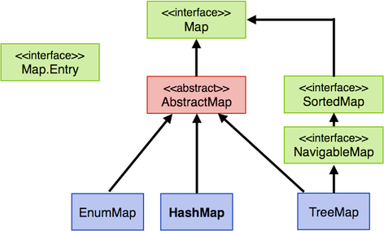
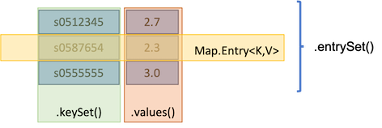

# Maps

*Maps* sind auch Collections. *Maps* sind Mengen von Schlüssel-Werte-Paaren. Wir können uns Maps als zweispaltige Tabellen vorstellen, in denen die linke Spalte die Schlüssel (*keys*) enthält und die rechte Spalte die Werte (*values*). Die Schlüssel in einer Map sind immer eindeutig, d.h. keine zwei Schlüssel in einer Map sind gleich. Tatsächlich handelt es sich bei der Menge der Schlüssel um eine `Set`. 

Obwohl Maps Collections sind, wurde für sie nicht das Interface [Collection](https://docs.oracle.com/en/java/javase/11/docs/api/java.base/java/util/Collection.html) implementiert, so wie für Listen und Mengen, sondern ein eigenes Interface [Map](https://docs.oracle.com/en/java/javase/11/docs/api/java.base/java/util/Map.html). Für Interessierte lohnt sich vielleicht auch ein Blick in die [Collections Framework Documentation](https://docs.oracle.com/en/java/javase/11/docs/api/java.base/java/util/doc-files/coll-index.html) und das [Collections Framework Tutorial](https://docs.oracle.com/javase/tutorial/collections/index.html).

#### Statt `add()` und `addAll()` hier `put()` und `putAll()`

Da nicht das `Collections`-Interface für `Maps` implementiert wurde, erfolgt das Hinzufügen eines Schlüssel-Werte-Paares zu einer `Map` leider auch nicht über `add()` bzw. das Hinzufügen einer Collection nicht über `addAll()`, sondern über 

- `put(K key, V value)` und
- `putAll(Map m)`.

`K` ist dabei ein Platzhalter für den Typ der Schlüssel und `V` ein Platzhalter für den Typ der Werte. 


#### Typ einer `Map` und Typ eines Schlüssel-Werte-Paares

Eine `Map` wird also mit zwei Typen typisiert:

- `Map<K, V>`

wobei `K` den Typ der Schlüssel und `V` den Typ der Werte definiert. 

Der Typ **eines einzelnen** Schlüssel-Werte-Paares ist

- `Map.Entry<K,V>`

Das sieht für uns natürlich auch erstmal ungewöhnlich aus. `Entry` ist eine *innere* Klasse in der Klasse `Map` (tatsächlich sind beides Interfaces). Wir nehmen das erstmal einfach so hin und merken uns: der (typisierte) Typ einer `Map` ist `Map<K,V>` und der (typisierte) Typ jedes einzelnen Schlüssel-Werte-Paares in dieser `Map` ist `Map.Entry<K,V>`. 

#### Statt `iterator()` hier `entrySet()`

Die Objektmethode `iterator()` gibt es für `Map` leider auch nicht. Stattdessen wird hier die Methode `entrySet()` verwendet. Da es sich bei einer `Map` um eine `Set` von lauter Schlüssel-Werte-Paaren (jeweils Typ `Map.Entry<K,V>`) handelt, liefert `entrySet()` eine 

- `Set<Map.Entry<K,V>>`

zurück. Lassen Sie sich von dieser kryptischen Schreibweise nicht abschrecken! Zurückgegeben wird eine `Set`. Diese ist typisiert und zwar mit dem Typ `Map.Entry`, welches der Typ eines einzelnen Schlüssel-Werte-Paares ist. `Map.Entry` ist selbst typisiert, nämlich mit dem Typ der Schlüssel `K` und dem Typ der Werte `V`. Für `K` und `V` werden bei Verwendung konkrete Typen eingesetzt. Hier sind es zunächst nur Platzhalter. 

#### Klassenbaum für `Map`

Der Klassenbaum für `Map` hat Ähnlichkeiten zum Klassenbaum für `Collection`. Wir finden hier wieder grüne (Interfaces), rote (abstrakte Klassen) und blaue (konkrete Klassen) Felder.



Auch hier ist es wieder so, dass wir `Map` als Typ für eine Map verwenden, aber für die Erzeugung konkreter Objekte die Klassen `EnumMap`, `HashMap` und `TreeMap` verwenden. Die am häufigsten verwendete Klasse ist `HashMap`, da sie am performantesten arbeitet. Sobald Reihenfolge/Sortierung eine Rolle spielt, wird `TreeMap` verwendet. 

#### Erstes Beispiel

Wir betrachten ein erstes Beispiel. Wir erstellen eine `HashMap` und fügen vier Einträge hinzu:

```java linenums="1"
import java.util.HashMap;
import java.util.Map;

public class Maps {

	public static void main(String[] args) 
	{
		Map<String,Double> m = new HashMap<>();
		m.put("s0512345", 1.7);		// neues Schluessel-Werte-Paar hinzugefuegt
		m.put("s0587654", 2.3);		// neues Schluessel-Werte-Paar hinzugefuegt
		m.put("s0512345", 2.7);		// Schluessel existiert bereits --> Wert geaendert
		m.put("s0555555", 3.0);		// neues Schluessel-Werte-Paar hinzugefuegt
	}
}
```

- In Zeile `8` wird unsere `Map` erzeugt. Die Referenzvariable auf die `Map` heißt `m`. Die Schlüssel sind vom Typ `String` und die Werte sind vom Typ `Double`. Das konkrete Objekt wird durch den Aufruf des Konstruktors der Klasse `HashMap` erzeugt. 
- In Zeile `9` fügen wir mithilfe der `put()`-Methode ein neues Schlüssel-Werte-Paar hinzu. Der Schlüssel (*key*) ist `"s0512345"`, der Wert (*value*) ist `1.7`. Beachten Sie, dass hier ein *Auto-Boxing* des `double`-Wertes `1.7` in ein `Double` stattfindet. 
- In Zeile `10` fügen wir mithilfe der `put()`-Methode ein weiteres Schlüssel-Werte-Paar hinzu. Der Schlüssel (*key*) ist `"s0587654"`, der Wert (*value*) ist `2.3` (erneut *Auto-Boxing*). 
- In Zeile `11` wird erneut die `put()`-Methode aufgerufen. Der Schlüssel `"s0512345"` existiert jedoch bereits. Deshalb wird nur der Wert geändert. Aus dem alten Wert `1.7` wird nun `2.7`. Die `Map` enthält nach dieser Anweisung (noch nur) **zwei** Einträge. 
- In Zeile `12` fügen wir mithilfe der `put()`-Methode ein weiteres Schlüssel-Werte-Paar hinzu. Der Schlüssel (*key*) ist `"s0555555"`, der Wert (*value*) ist `3.0` (erneut *Auto-Boxing*). 

Nach diesen Anweisungen sieht unsere Map also wie folgt aus (die Überschriften der Tabelle dienen nur der Orientierung):


Die folgende Abbildung zeigt die Methoden, um Zugriff auf die Werte, Schlüssel und alle Einträge zu erhalten:



Die Anwendung dieser Methoden auf unsere Map `m` zeigen die folgenden Anweisungen:

```java linenums="1"
Set<String> keys = m.keySet();					// Menge aller Schluessel
Collection<Double> values = m.values();			// Collection aller Werte
Set<Map.Entry<String, Double>> entries = m.entrySet();	// Menge aller Schluessel-Werte-Paare
```

- die Objektmethode `keySet()` liefert die Menge aller Schlüssel zurück; Rückgabetyp ist `Set<K>`,
- die Objektmethode `values()` liefert eine Collection aller Werte zurück; Rückgabetyp ist `Collection<V>`,
- die Objektmethode `entrySet()` liefert die Menge aller Schlüssel-Werte-Paare zurück; Rückgabetyp ist `Set<Map.Entry<K,V>>`

#### Durch eine `Map` laufen

Um alle Schlüssel-Werte-Paare einer Map zu extrahieren, können wir, wie bereits erwähnt, die Methode `entrySet()` verwenden. Für den Rückgabetyp `Map.Entry<K,V>` stehen uns zwei weitere Objektmethoden zur Verfügung:

- `getKey()` liefert den Schlüssel des Schlüssel-Werte-Paares zurück; Rückgabetyp ist `K`,
- `getValue()` liefert den Wert des Schlüssel-Werte-Paares zurück; Rückgabetyp ist `V`.

Wir betrachten für unsere Map `m` ein Beispiel: 

```java linenums="1"
for(Map.Entry<String, Double> eintrag : m.entrySet())
{
	System.out.println(	eintrag.getKey() + "  :  " + eintrag.getValue());
}
```	
- In Zeile `1` wird die Methode `m.entrySet()` aufgerufen, diese gibt eine `Set<Map.Entry<String, Double>>` zurück. Jeder einzelne Eintrag in dieser `Set` ist also vom Typ `Map.Entry<String,Double>`. Deshalb verwenden wir diesen Typ für unsere Variable `eintrag`. Wir nutzen hier also erneut die *for-each*-Schleife, um durch eine `Set` zu laufen. 
- In Zeile `3` verwenden wir die Objektmethoden `getKey()` und `getValue()`, die uns von `Map.Entry` zur Verfügung gestellt werden. `getKey()` gibt uns hier einen `String` zurück (den Schlüssel) und `getValue()` gibt hier ein `Double` zurück (den Wert). Hier erfolgt eine automatische Konvertierung von `Double` nach `String` (impliziter Aufruf von `toString()` für `Double`). 

Es erfolgt folgende Ausgabe:

```bash
s0512345  :  2.7
s0555555  :  3.0
s0587654  :  2.3
```

Wir sehen also, dass die Reihenfolge des Einfügens der Elemente nicht gewahrt bleibt. Die Schlüssel werden auch nicht sortiert, das sieht hier nur so aus. 

Wir probieren auch noch die Objektmethoden `keySet()` und `value()` aus, die für eine `Map` zur Verfügung stehen:

```java
for(String schluessel : m.keySet())
{
	System.out.println("key : " + schluessel);
}
```

erzeugt: 

```bash
key : s0512345
key : s0555555
key : s0587654
```

und 

```java
for(Double wert : m.values())
{
	System.out.println("value : " + wert.toString());  // toString() wuerde auch implizit aufgerufen
}
```

erzeugt: 

```bash
value : 2.7
value : 3.0
value : 2.3
```

!!! Übung

	Was wird ausgegeben?
	```java
	Map<String, String> accounts = new HashMap<>();

	accounts.put("anton", "anton@email.de");
	accounts.put("berta", "berta@email.de");
	accounts.put("caesar", "caesar@email.de");
	accounts.put("anton", "antonius@email.de");

	// Iteration ueber alle Eintraege (Map.Entry) der Map
	for(Map.Entry<String, String> entry : accounts.entrySet()) 
	{
		System.out.println("Account : " + entry.getKey() + " E-Mail : " + entry.getValue());
	}
	```


## Zusammenfassung Maps

- Maps speichern Referenztypen als Schlüssel und Werte
- Maps werden typisiert mit `K` (Platzhalter für den Referenztyp des Schlüssels) und `V` (Platzhalter für den Referenztyp des Wertes) 
- Maps enthalten eindeutige Zuordnungen von einem Wert zu einem Schlüssel (aber nicht umgekehrt)
- der Zugriff auf alle Einträge/Schlüssel/Werte erfolgt über Sets/Collection
- der Typ eines einzelnen Schlüssel-Werte-Paares ist `Map.Entry<K,V>`

Hier noch ein Überblick über die wichtigsten Objektmethoden für eine `Map`. Weitere Methoden finden Sie [hier](https://docs.oracle.com/en/java/javase/11/docs/api/java.base/java/util/Map.html).

<table>
	<colgroup>
       <col span="1" style="width: 35%;">
       <col span="1" style="width: 65%;">
    </colgroup>
	<thead>
		<tr>
			<th>Objektmethode </th>
			<th>Beschreibung </th>
		</tr>
	</thead>
	<tbody>
		<tr>
			<td> <code>V get(K key)</code> </td>
			<td>Gibt den Wert zum Schlüssel <code>key</code> zurück. Ist der Schlüssel <code>key</code> nicht in der <code>Map</code> enthalten, wird <code>null</code> zurückgegeben.</td>
		</tr>
		<tr>
			<td> <code>V put(K key, V value)</code> </td>
			<td>Fügt einen neuen Eintrag mit dem Schlüssel <code>key</code> und dem Wert <code>value</code> in die <code>Map</code> ein. Wenn ein Eintrag für Schlüssel <code>key</code> bereits existiert, wird der <code>value</code> <strong>überschrieben</strong>.</td>
		</tr>
		<tr>
			<td> <code>void putAll(Map<K,V> m)</code>  </td>
			<td>Fügt <strong>alle</strong> Element der Map <code>m</code> in die Map ein. Wenn ein Eintrag für einen Schlüssel bereits existiert, wird er <strong>überschrieben</strong>.</td>
		</tr>
		<tr>
			<td> <code>void clear()</code>  </td>
			<td>Entfernt alle Elemente aus der Map.</td>
		</tr>
		<tr>
			<td> <code>boolean containsKey(Object k)</code>  </td>
			<td>Gibt <code>true</code> zurück, wenn es einen Eintrag mit dem Schlüssel <code>k</code> in der Map gibt. Der Vergleich der Schlüssel mit dem Objekt <code>k</code> erfolgt mit der <code>equals()</code>-Methode.</td>
		</tr>
		<tr>
			<td> <code>boolean containsValue(Object v)</code>  </td>
			<td>Gibt <code>true</code> zurück, wenn es einen Eintrag mit dem Wert <code>v</code> in der Map gibt. Der Vergleich der Werte mit dem Objekt <code>v</code> erfolgt mit der <code>equals()</code>-Methode.</td>
		</tr>
		<tr>
			<td> <code>boolean isEmpty()</code>  </td>
			<td>Gibt <code>true</code> zurück, wenn sich keine Elemente in der Map befinden.</td>
		</tr>
		<tr>
			<td> <code>V remove(Object key)</code>  </td>
			<td>Entfernt den Eintrag mit dem Schlüssel <code>key</code> aus der Map und gibt den dazugehörigen <strong>Wert</strong> zurück (wenn <code>key</code> in der Map enthalten ist, sonst <code>null</code>).</td>
		</tr>
		<tr>
			<td> <code>int size()</code>  </td>
			<td>Gibt die Anzahl der Elemente in der Map zurück.</td>
		</tr>
		<tr>
			<td> <code>Set<K> keySet()</code>  </td>
			<td>Gibt eine <code>Set</code> mit allen Schlüsseln der Map zurück.</td>
		</tr>
		<tr>
			<td> <code>Collection<V> values()</code>  </td>
			<td>Gibt eine <code>Collection</code> mit allen Werten der Map zurück.</td>
		</tr>
		<tr>
			<td> <code>Set<Map.Entry<K,V>> entrySet()</code>  </td>
			<td>Gibt eine <code>Set</code> mit allen Einträgen (Schlüssel-Werte-Paare) als <code>Map.Entry<K,V></code> der Map zurück.</td>
		</tr>
	</tbody>
</table>


