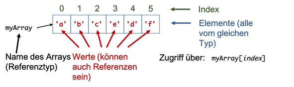
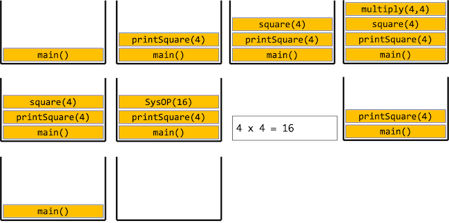

# Wiederholung

## Datentypen

### Wertetypen

- es wird der konkrete Wert in der Variablen gespeichert
- belegen abhängig vom Datentyp unterschiedlich viel Arbeitsspeicher --> unterschiedliche Wertebereiche

=== "Beispiele Wertetypen"
	
```java
	// boolean für Wahrheitswerte true und false
	boolean x = false; 			// mit false initialisiert
	boolean wahr = true; 		// Schluesselwort true
	boolean falsch = !wahr; 	// Enthaelt den Wert false
	
	// byte, short, int, long für ganze Zahlen
	byte a = 0; 		// mit 0 initialisiert
	short b = 124; 		// Zuweisung einer ganzen Zahl
	int c = a + b; 		// Wertebereich immer beachten!
	long lo = c * 200; 	// l nicht als Variablenname verwenden
	
	// char für ein einzelnes Zeichen - einfache Anfuehrungszeichen!
	char zeichen = 'c'; 	// Doppelte " für Strings! 
	
	// float und double für Fließkommazahlen
	float f = 0.0f; 		// Wird mit 0.0 initialisiert
	double d = 100.25; 		// Dezimalpunkt statt Dezimalkomma!!
 ```

### Referenztypen

- es wird eine Referenz auf ein Objekt gespeichert
- Objekte besitzen Eigenschaften: Methoden (Verhalten) und Variablen (Zustand)
- Zugriff auf Methoden und Variablen über den Punkt-Operator

=== "Beispiele Referenztypen"
```java
	// Schluesselwort class um neue Klasse (Typ) zu definieren
	public class Power
	{
	int base; // Objektvariablen, für jedes Objekt
	int exp;  // existieren Kopien im Arbeitsspeicher
	
			public Power(int base, int exp)
			{
				this.base = base;
				this.exp = exp;
			}
	
			// Objektmethode
			public void print()
			{
				System.out.println(this.base + "^" + this.exp);
			}
		}
	
		// irgendwo im Hauptprogramm
		public static void main(String[] args) 
		{
			Power p1 = new Power(2,4);
			Power p2 = new Power(2,4);
			p1.print();
			p2.print();
			boolean equal = (p1 == p2); 	// true oder false ?
		}
```

## Datenstrukturen

### Variablen

- einfachste Datenstruktur --> speichern genau einen Wert (kann auch Referenz auf ein Objekt sein)
- sind von einem Datentyp (Wertetyp oder Referenztyp)
- haben einen Namen
- besitzen einen Wert
	- Wert kann sich bei Variablen zur Laufzeit ändern (Wertzuweisungsoperator =)
	- Wert von Konstanten kann nicht mehr geändert werden (final)
- besitzen einen Gültigkeitsbereich (den sogenannten Scope)
	- Scope einer Variable: der Anweisungsblock, in dem die Variable deklariert wurde
	- lokale Variable: in einer Methode deklariert --> dort lokal
	- globale Variable: in einer Klasse deklariert --> dort global

=== "Beispiele Variablen"
```java
	int zahlen = 0; 			// konventionelle Variable
	final float PI = 3.14516f; 	// Konstante

	// Erzeugen eines neuen Feldes (Arrays) und Zuweisen der Referenz
	int[] zahlenFeld = new int[100];

	// Klassen mit Objekt- und Klassenvariablen
	public class Power 
	{
		int base; // Objektvariablen, für jedes Objekt
		int exp;  // existieren Kopien im Arbeitsspeicher

		public Power(int base, int exp)
		{
			this.base = base;
			this.exp = exp;
		}

		public String toString()
		{
			// lokale Variable --> nur in der Methode gueltig
			String output =  this.base + "^" + this.exp;
			return output;
		}

		// Variablen sollten mit einem Kleinbuchstaben beginnen
		// Konstanten sollten nur mit Großbuchstaben benannt werden
	}
```

### Arrays



- Arrays sind Objekte (Referenztypen)
- speichern eine festgelegte Anzahl von Werten eines festgelegten Datentyps (können Werte- und Referenztypen sein)
- besitzen Methoden (z.B. `sort()`) und Variablen (z.B. `length`)
- können auch mehrdimensional sein
- Zugriff auf Elemente mit eckigen Klammern unter Verwndung des Indexes

=== "Beispiele Arrays"
```java
	// Einfache Deklaration -> nur Datentyp bekannt, keine Laenge
	int[] zahlen; 			// Eckige Klammern für Array-Datentyp

	// Erzeugen eines neuen Feldes und Zuweisen der Referenz
	zahlen = new int[100]; 	// new-Operator, hier: Angabe der Laenge

	// Explizite Initialisierung bei der Deklaration
	// Bei Initialisiert mit Werten --> keine Laengenangabe noetig
	float[] werte = new float[10]; 		// Platz für 10 Werte 
	double[] fib = { 1.0, 2.0, 3.0 };	// Werte in {}-Klammern

	// Mehrdimensionale Felder
	int[][] hdBild = new int[1920][1080];

	// Felder können für alle Datentypen verwendet werden
	Power[] potenzen = new Power[5]; 	// Noch keine Objekte enthalten
	potenzen[0] = new Power(2, 4); 		// Zuweisung Objekt an Index 0
```

## Literale

- sind Werte
- sind von einem bestimmten Datentyp (kann auch ein Referenztyp sein)
- keine ausführbare Einheit --> kein Ausdruck --> können nicht alleine stehen
- meistens
	- auf der rechten Seite einer Wertzuweisung
	- als Parameterwert bei Aufruf einer Methode
	- als Vergleichswert bei logischen Ausdrücken

=== "Beispiele Literale"
```java
	100
	true
	'a'
	"hallo"
	{1,2,3,4}
	5.5
```

## Ausdrücke

- kleinste ausführbare Einheit eines Programms
- z.B.:
	- Zuweisung
	- numerische Berechnung
	- logische Bedingung

- Operatoren:
	- arithmetisch:		`+, -, *, /, %, ++, --`
	- relational: 		`==, !=, <, >, <=, >=`
	- logisch:			`!, &&, ||`
	- Zuweisung:		`=, +=, -=, *=, /=, %=`
	- sonstige:			`a?b:c, typecast, new, instanceof, .`

## Anweisungen

- Einzelanweisung		`;`
- Block					`{}`
- Deklaration			`Typ Methode`, `Typ Variable`
- Ausdruck
- Bedingung				`if() else 	switch() case`
- Schleifen				`for		while		do while`
- Exceptions 			`try catch()`
- Assertions			`assert`


=== "Beispiele Anweisungen"
```java
// Bloecke immer zwischen geschweiften Klammern
{
// Anweisung 1...
// Anweisung 2...
}

	// Definition und Deklaration
	int a;
	float b = 1.0f;

	// Einfacher Ausdruck
	a = 1010; 

	// Bedingungen
	if (a == 1010)  		// if-Zweig muss immer vorhanden sein
	{
		// Anweisungen...
	}
	else if (a == 1011)  	// 0 - beliebig viele else-if-Zweige
	{
		// Anweisungen...
	}
	else  			// 0 - 1 else-Zweig
	{
		// Anweisungen...
	}

	switch (a) 		// zu pruefende Variable in Klammern
	{
		case 1010: { b*=2.0; break; }	// beliebig viele case-Zweige
		case 1011: { b*=3.0; break; }	// break nicht vergessen
		default: { b=0.0f; } 			// Zweig für alle anderen Werte
	}

	int[] meinFeld = {1,2,3,4,5};
	// for-Schleife
	// 1. Initialisierung
	// 2. Schleifen-Bedingung
	// 3. Anweisungen nach Schleifendurchlauf
	// Schleifen-Anweisungen als Block hinter for
	for (int index = 0; index < meinFeld.length; index++) 
	{
		System.out.println(meinFeld[index]);
	}

	// while-Schleife
	// Nur Schleifen-Bedingung angeben
	// Auf Endlos-Schleifen achten
	while (index < meinFeld.length) 
	{ 
		System.out.println(meinFeld[index]);
		index++;
	}
```

## Methoden

- wiederverwendbare und/oder logisch abgeschlossene Programmteile sollten in Methoden zusammengefasst werden
- Methoden besitzen einen Namen (im Scope eindeutig), keinen, einen oder mehrere Parameter und einen Rückgabetyp (evtl. `void`)
- Aufruf einer Methode durch Namen und runde Klammern, in welche Werte für die Parameter übergeben werden
- bei Aufruf einer Methode werden alle Anweisungen abgearbeitet, die in der Methode definiert (implementiert) wurden (bis zum `return`)
- werden Methoden mit Rückgabetyp (also nicht `void`) aufgerufen, entspricht ihr Aufruf einem konkreten Wert (Rückgabewert)

=== "Methodenstack/Call stack"
```java
public static int multiply(int a, int b) {
return a*b;
}

	public static int square(int n) {
		return multiply(n,n);
	}

	public static void printSquare(int n) {
	int squared = square(n);
	System.out.println(n + " x " + n + " = " + squared);
	}

	public static void main(String[] args) {
		printSquare(4);
	}
```



## Vererbung

- Weitergabe aller Methoden und Objekte einer Elternklasse (Basisklasse) an eine Kindklasse (Subklasse)
- Schlüsselwort `extends`
- jede Klasse (bis auf `Object`) besitzt genau eine Elternklasse; ist keine angegeben, ist es automatisch `Object`
- Vererbung beschreibt „is-a“-Beziehung
- Methoden der Elternklasse können überschrieben werden (wenn sie nicht als `final` definiert wurden) --> @Override verwenden
- Originalmethode kann mit Schlüsselwort `super` aufgerufen werden

## Konstruktoren

- besondere Objektmethoden, die beim Erzeugen des Objektes aufgerufen werden
- gleicher Name wie die Klasse, keinen Rückgabetyp angeben (auch nicht `void`)
- wird kein Konstruktor definiert, steht automatisch (implizit) ein parameterloser Konstruktor zur Verfügung (einzige Ausnahme: in der Elternklasse existieren nur parametrisierte Konstruktoren)
- Aufruf von `this` und `super` möglich
- werden nicht vererbt

=== "Beispiele Konstruktoren"

```java
	public class Power {
	int base;
	int exp;

		public Power()
		{
			this(1,0); 	// Aufruf des Konstruktors in Zeile 15
		}

		public Power(int base)
		{
			this(base, 0); 	// Aufruf des Konstruktors in Zeile 15
		}

		public Power(int base, int exp)
		{
			this.base=base; 	// Parameterwerte für base und int
			this.exp=exp; 		// auf Objektvariablen sichern
		}
	}

	public static void main(String[] args) {
		Power p1 = new Power(); 		// p1.base = 1, p1.exp = 0
		Power p2 = new Power(10); 		// p2.base = 10, p2.exp = 0
		Power p3 = new Power(10,5); 	// p3.base = 10, p3.exp = 5
	}
```

## Access Controller (Zugriffsmodifizierer)

- Steuerung der Lebensdauer, Sichtbarkeit und Veränderbarkeit von Klassen, Methoden und Variablen – Prinzip der Datenkapselung
- Klassen
	- `public`		Zugriff von außerhalb des Paketes
	- (default)		Zugriff nur innerhalb des Paketes
	- `final`		von der Klasse können keine Klassen erben
	- `abstract` 	Klasse besitzt Methoden, die keinen Methodenrumpf besitzen (nicht implementiert sind)

- Variablen und Methoden (wenn Klasse `public`)
	- `public` 		Zugriff von überall (bei Variablen vermeiden!)
	- `protected`	Zugriff aus Klasse und Kindklasse
	- (default)		Zugriff aus Klasse und Paket
	- `private` 		Zugriff nur aus Klasse

## "Kleinigkeiten", die wir nicht betrachtet haben

### Das Schlüsselwort `static`

Mit dem Schlüsselwort `static` beschreiben wir eine Eigenschaft der Klasse. Das Schlüsselwort `static` kann verwendet werden für

- Die Deklaration einer (*Klassen-*)Variablen. Eine *Klassenvariable* existiert für die Klasse genau ein Mal (alle Objekte der Klasse "teilen" sich diese eine Variable).
- Die Deklaration einer (*Klassen-*)Methode. Eine statische Methode (*Klassenmethode*) kann aufgerufen werden, ohne ein Objekt der Klasse zu erzeugen. Wir werden häufig statische Methoden in der Programmklasse (die Klasse mit der `main()`-Methode) erstellen, um diese in der `main()`-Methode aufzurufen, ohne vorher ein Objekt der Programmklasse erzeugen zu müssen.
- Die Deklaration einer Klasse, wenn diese eine Klasse **in** einer anderen Klasse ist. Dazu kommen wir später.

Der Zugriff auf eine statische Variable bzw. statische Methode erfolgt ebenfalls per Punktnotation, aber vor dem Punkt steht dann der Klassenname. Häufig wird der Klassenname und der Punkt aber auch weggelassen.

### Die *for-each*-Schleife

Wir haben ein Array stets so durchlaufen, dass wir in einer `for`-Schleife jeden möglichen Index für das Array erzeugt haben und dann über den Index auf den Wert der einzelnen Elemente zugegriffen haben, also z.B.:

```java
int[] numbers = {1, 2, 3, 4, 5, 6, 7, 8, 9 };
for (int index = 0; index < args.length; index++) 
{
	System.out.print(numbers[index]);
}
```

Wenn wir **alle** Elemente eines Arrays **lesen** wollen, können wir das aber auch so machen:

```java
int[] numbers = {1, 2, 3, 4, 5, 6, 7, 8, 9 };
for(int number : numbers)
{
	System.out.print(number);
}
```

Wir bezeichnen diese Schleifensyntax auch als *for-each*-Schleife. Die allgemeine Syntax ist

```java
for(TypElement variablenNameElement : nameDesArrays)
{
	// hier lesende Verwendung von variablenNameElement
}
```

Beachten Sie, dass Sie mit der *for-each*-Schleife nur lesenden Zugriff auf die Elemente des Arrays haben. Wenn Sie z.B. schreiben

```java
int[] numbers = {1, 2, 3, 4, 5, 6, 7, 8, 9 };
for(int number : numbers)
{
	number = 5;
}
```

, dann ändert das nichts an den Werten im Array! Beachten Sie aber auch, dass das Element ja auch eine Referenz auf ein Objekt sein könnte, dann verhält es sich natürlich anders, wenn Sie dafür Objektmethoden aufrufen, die Änderungen am Objekt bewirken (*Setter*).

### Die Klasse `java.util.Arrays`

Die Klasse `Arrays` aus dem `java.util`-Paket hat einige nützliche Methoden für Arrays. Insbesondere interessant dürfte die `toString()`-Methode sein. Wir werden diese Klasse manchmal verwenden, wenn wir uns z.B. keine eigenen `toString()`-Methoden für unsere Arrays schreiben wollen. Die Dokumentation der Klasse `Arrays` finden Sie z.B. [hier](https://docs.oracle.com/javase/8/docs/api/java/util/Arrays.html). Beachten Sie, dass Sie zum Verwenden der Klasse das `java.util`-Paket importieren müssen.

```java
int[] numbers = {1, 2, 3, 4, 5, 6, 7, 8, 9 };
System.out.println(Arrays.toString(numbers));
```

Weitere interessante Methoden dieser Klasse sind `copyOf()`, `binarySearch()` und `sort()`.


??? "Übung"
		Ist die `toString()`-Methode der `Arrays`-Klasse statisch oder handelt es sich um eine Objektmethode?

