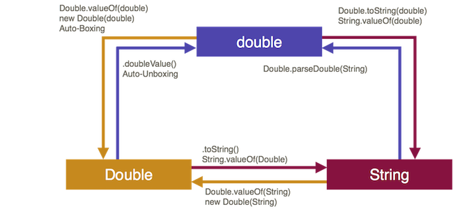

# Wrapper-Klassen

!!! success "Motivation"
	Letzte Woche haben wir mit folgender Fragestellung geendet: Wie wandeln wir einen `String` zu einem `int` (oder `double`) um? Die Antwort, die uns den Ausblick auf das Thema der heutigen Woche gibt, war: **mit Wrapper-Klassen**.

In Programmierung I haben wir am Anfang die Datentypen `int`, `boolean`, `double`, `char`, `long` usw. kennengelernt. Wir haben diese Datentypen als *Wertetypen* kennenglernt, denn sie können nur Werte abbilden. Das Gegenstück dazu sind *Referenztypen*, welche Referenzen auf Objekte repräsentieren. Für jeden Wertetyp gibt es aber auch einen entsprechenden Referenztyp, die sogenannten *Wrapper-Klassen*. Diese sind `Integer`, `Double`, `Float`, `Short`, `Byte`, `Long`, `Character` und `Boolean` und befinden sich im `java.lang`-Paket (also dem Standardpaket von Java - muss nicht importiert werden). Wir werden diese Wrapper-Klassen dieses Semester häufiger verwenden, insbesondere wenn wir *Collections* kennenlernen. 

Die grundsätzliche Idee von *Wrapper-Klassen* ist das "Verpacken" (*wrappen*) eines Wertetyps in einen Referenztyp. Die folgende Abbildung soll das für das Beispiel `int` <--> `Integer` verdeutlichen:


Der `int`-Wert `10` wird zu einem Typ `Integer` und somit zu einem Referenztyp. Dafür sind alle Vorteile von Referenztypen nutzbar, z.B. Objektmethoden, Vererbung usw. 

Welche Wrapper-Klasse zu welchem Wertetyp gehört, wird aus dem Namen erkennbar. Leider ist das aber nicht ganz konsistent. Während die Wrapper-Klassen von `boolean`, `byte`, `short`, `long`, `float` und `double` so heißen, wie die Wertetypen, nur jeweils mit einem Großbuchstaben am Anfang, heißt die Wrapper-Klasse von `char` `Character` und die Wrapper-Klasse von `int` `Integer`. 

<table>
	<thead>
		<tr>
			<th> Wertetyp </th>
			<th>Referenztyp (Wrapper-Klasse) </th>
		</tr>
	</thead>
	<tbody>
		<tr>
			<td> <code>byte</code> </td>
			<td> <code>Byte</code> </td>
		</tr>
		<tr>
			<td> <code>short</code> </td>
			<td> <code>Short</code> </td>
		</tr>
		<tr>
			<td> <code>int</code>  </td>
			<td> <code>Integer</code>  </td>
		</tr>
		<tr>
			<td> <code>long</code>  </td>
			<td> <code>Long</code>  </td>
		</tr>
		<tr>
			<td> <code>float</code>  </td>
			<td> <code>Float</code>  </td>
		</tr>
		<tr>
			<td> <code>double</code>  </td>
			<td> <code>Double</code>  </td>
		</tr>
		<tr>
			<td> <code>boolean</code>  </td>
			<td> <code>Boolean</code>  </td>
		</tr>
		<tr>
			<td> <code>char</code>  </td>
			<td> <code>Character</code>  </td>
		</tr>
	</tbody>
</table>

## Objekterzeugung

Es gibt ziemlich viele Möglichkeiten, um Objekte eines Wrapper-Klassen-Typs zu erzeugen:

- Verwendung des Kontruktors, Parameterwert entweder vom Typ `String` oder vom entsprechenden Wertetyp,
- Verwendung der statischen Methode `valueOf()`,  Parameterwert entweder vom Typ `String` oder vom entsprechenden Wertetyp,
- sogenanntes *Boxing* (automatisches *wrappen* eins Wertes in seinen Referenztyp).

Wir schauen uns die drei Möglichkeiten am Beispiel von `Integer` an. Es gilt aber für alle Wrapper-Klassen. 

### Verwendung des Kontruktors - deprecated

Für jede Wrapper-Klasse stehen zwei parametrisierte Konstruktoren zur Verfügung, entweder wird ein entsprechender Wert übergeben (am Beispiel von `Integer` als ein `int`-Wert) oder es wird ein `String` übergeben, der idealerweise einen passenden Wert entält, also für `Integer` soll der `String` eine Zahl enthalten. Am Beispiel von `Integer` könnte das z.B. so aussehen:

```java
// Konstruktor mit Uebergabe Wertetyp
int i = 100;
Integer iObject1 = new Integer(i);
Integer iObject2 = new Integer(100);

// Konstruktor mit Uebergabe String
String s = "100";
Integer iObject3 = new Integer(s);
Integer iObject4 = new Integer("100");

// Moeglich für alle numerischen Datentypen und boolean
```

Für `Character` gibt es nur einen parametrisierten Konstruktor: `Character​(char value)`. Die Übergabe eines `Strings` ist dort nicht möglich. 

Wichtig hier ist zu betonen, dass man die Konstruktoren jedoch nicht verwenden sollte. Das hat hauptsächlich Performance-Gründe, sowohl in Zeit als auch in Speicher. Seit Java 9 gelten die Konstruktoren als **deprecated**, sollten also nicht mehr verwendet werden. Stattdessen wird empfohlen, die statischen Methoden `valueOf()` zu verwenden. 

### Die `valueOf()`-Methoden

Die `valueOf()`-Methoden der Wrapper-Klassen haben zwei wichtige Eigenschaften:

1. sie sind statisch, d.h. der Aufruf erfolgt über `Klassenname.valueOf()`,
2. sie sind sogenannte *Erzeugermethoden*, denn sie geben ein Objekt der Klasse zurück

Wie bei den Konstruktoren auch, können der Methode entweder ein Wert vom entsprechenden Typ oder ein `String` übergeben werden, der ein Wert von dem Wertetyp enthält. Beispiele

```java
// Wrapper-Klassen haben die Klassenmethoden
// valueOf(Wertetyp b) ...
Integer iObject1 = Integer.valueOf(100);
Boolean bObject1 = Boolean.valueOf(true);
Double 	dObject1 = Double.valueOf(5.5);

// ... oder valueOf(String s)
Integer iObject2 = Integer.valueOf("100");
Boolean bObject2 = Boolean.valueOf("true");
Double 	dObject2 = Double.valueOf("5.5");
```

Auch hier gilt wieder, dass für `Character` nur eine `valueOf()`-Methode existiert, nämlich `valueOf(char c)`. Die Übergabe eines `Strings` ist nicht möglich. 

### Auto-Boxing

Die dritte Möglichkeit, Objekte einer Wrapper-Klasse zu erzeugen, besteht darin, den entsprechenden Wert *automatisch* "wrappen" zu lassen, das sogenannte *Auto-Boxing*.  Beispiele:

```java 
Integer   io1 = 100;
Boolean   bo1 = true;
Character co1 = 'a';
Double    do1 = 5.5;
Float     fo1 = 2.7f;
Long      lo1 = 1234L;
```

Wahrscheinlich wird diese Form der Objekterzeugung die von Ihnen am meisten verwendete werden. Das ist auch völlig in Ordnung. Sie sollten sich nur dessen bewusst sein, dass dabei ein solches *Auto-Boxing* passiert. Es ist empfehlenswert, gerade zu Anfang, Eclipse (oder Ihre IDE) so einzustellen, dass Sie eine Warnung erhalten, wenn ein solches Auto-Boxing passiert. das hat den Vorteil, dass die dieses Vorgehen nicht aus dem Blick verlieren, sondern dass Ihnen bewusst bleibt, dass die Werte gerade in eine Referenz umgewandelt werden. Wählen Sie dazu in Eclipse unter `Eclipse` --> `Preferences` --> `Java` --> `Compiler` --> `Errors/Warnings` folgende Einstellungen:


!!! Übung

	Was wird ausgegeben und warum? 
	```java
		Integer i1 = 5000;
		Integer i2 = 5000;

		System.out.println(i1 == i2);
	```

## Werte extrahieren

Häufig wollen wir aus unseren Wrapper-Objekten wieder die "Werte extrahieren", also z.B. erfahren, welcher `int`-Wert von einem `Integer`-Objekt repräsentiert wird. Um das zu tun, stellen die Wrapper-Klassen jeweils `<wrapperTyp>Value()`-Objektmethoden zur Verfügung also: `intValue()`, `doubleValue()`, `charValue()`, `booleanValue()` usw. Betrachten wir nochmal die Beispiele von eben:

```java
Integer   io1 = 100;
Boolean   bo1 = true;
Character co1 = 'a';
Double    do1 = 5.5;
Float     fo1 = 2.7f;
Long      lo1 = 1234L;

int 	i1 = io1.intValue(); 		// 100
boolean b1 = bo1.booleanValue(); 	// true
char 	c1 = co1.charValue(); 		// 'a'
double 	d1 = do1.doubleValue();		// 5.5
float 	f1 = fo1.floatValue(); 		// 2.7
long 	l1 = lo1.longValue();		// 1234
```

Aber auch hier gibt es wieder ein *Auto-Unboxing*. Das heißt, es wäre auch möglich auf die `<wrapperTyp>Value()`-Objektmethode zu verzichten und stattdessen einfach das hier zu schreiben:

```java
int 	i2 = io1; 	// 100
boolean b2 = bo1; 	// true
char 	c2 = co1; 	// 'a'
double 	d2 = do1;	// 5.5
float 	f2 = fo1; 	// 2.7
long 	l2 = lo1;	// 1234
```

Auch hier sollte man sich aber stets der Tatsache bewusst sein, dass ein *Unboxing* passiert. 

!!! Übung

	Geht das und wenn ja, warum? Was wird jeweils ausgegeben?
	```java
		Integer i1 = 5000;
		Integer i2 = 5000;
		Integer i3 = 5001;
		
		System.out.println(i1 >= i2);
		System.out.println(i3 > i2);
	```

Die folgende Abbildung zeigt einen Überblick über die einzelnen Konvertierungen am Beispiel von `Double`. Beachten Sie dabei auch, dass ein Wert direkt aus einem passenden `String` erzeugt werden kann, indem die statische `<WrapperTyp>.parse<WrapperTyp>`-Methode verwendet wird. 



## Strings in Wertetypen

Wir wissen jetzt schon, dass wir uns mithilfe der `valueOf(String s)`-Methode Objekte einer Wrapper-Klasse erzeugen können. Unter Verwendung von `intValue()` könnte man z.B. aus einem `Intger`-Objekt den `int`-Wert extrahieren. Das ginge auch mit *Auto-Unboxing*. Für die Umwandlung von `String` nach `int` verwendet man aber am besten die `parseInt()`-Methode. 

```java
String eingabe = JOptionPane.showInputDialog("Geben Sie eine Zahl ein: ");
int zahl = Integer.parseInt(eingabe);
```

Für `double` steht uns dafür `Double.parseDouble(String s)` zur Verfügung usw. 

!!! success
	Jetzt haben wir unser Problem gelöst, wir können `String` in einen `int` umwandeln! Wir kennen nun Wrapper-Klassen und deren `parseXXX(String)`-Methoden.

## Links zu den Java-Docs

Hier sind die Links zu den jeweiligen Java-Dokumentationen der Klassen aufgelistet (für Java 11). Ein Blick lohnt sich, da für die einzelnen Klassen jeweils viele Objektmethoden zur Verfügung stehen, die Ihnen sehr nützlich sein können. 

- [Boolean](https://docs.oracle.com/en/java/javase/11/docs/api/java.base/java/lang/Boolean.html)
- [Byte](https://docs.oracle.com/en/java/javase/11/docs/api/java.base/java/lang/Byte.html)
- [Character](https://docs.oracle.com/en/java/javase/11/docs/api/java.base/java/lang/Character.html)
- [Double](https://docs.oracle.com/en/java/javase/11/docs/api/java.base/java/lang/Double.html)
- [Float](https://docs.oracle.com/en/java/javase/11/docs/api/java.base/java/lang/Float.html)
- [Integer](https://docs.oracle.com/en/java/javase/11/docs/api/java.base/java/lang/Integer.html)
- [Long](https://docs.oracle.com/en/java/javase/11/docs/api/java.base/java/lang/Long.html)
- [Short](https://docs.oracle.com/en/java/javase/11/docs/api/java.base/java/lang/Short.html)

Übrigens erben die numerischen Datentypen alle von der Klasse [Number](https://docs.oracle.com/en/java/javase/11/docs/api/java.base/java/lang/Number.html). Diese enthält die Objektmethoden `byteValue()`, `doubleValue()`, `floatValue()`, `intValue()`, `longValue()` und `shortValue()`. Deswegen werden in allen numerischen Wrapper-Klassen auch alle diese Objektmethoden zur Verfügung gestellt. 

!!! Übung 

	Diese Übung gibt ein Hinweis auf das folgende Thema:
	Schauen Sie sich einmal die Java-Dokumentation der Klasse `Integer` an. Welche Exception kann die `parseInt(String)`-Methode werfen? 

### Ausblick

Wir wissen nun, wie wir einen `String` in ein `int` umwandeln. Nämlich mithilfe der `parseInt(String)`-Methode der Klasse `Integer`. Was aber passiert, wenn der `String` gar keiner Zahl entspricht? Dann wird eine [Exception](exceptions.md#exceptions) geworfen und das Programm sofort beendet. Wir können aber gar nichts dafür, dass die Nutzerin keine Zahl eingegeben hat. Unser Programm ist eigentlich korrekt. Wie können wir den Programmabsturz verhindern? Wie können wir die Nutzerin solange bitten, eine Zahl einzugeben, bis sie wirklich eine Zahl eingibt?
